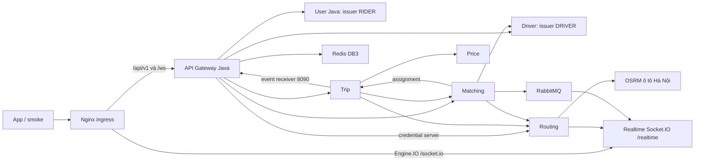

# Deploy backend Docker và Kubernetes local

| Thuộc tính | Giá trị |
| --- | --- |
| Service | Toàn hệ thống |
| Rà soát | 2026-10-06 |
| Quy ước | [Format và số liệu](quy-uoc-tai-lieu.md) |

Stack đã chạy trên Docker Desktop, Kubernetes context docker-desktop v1.34.1, namespace chande-local. Public ingress: Docker http://127.0.0.1:18080; Kubernetes http://127.0.0.1:18081 qua port-forward loopback. Đây là deployment local, chưa phải hosting Internet/production.

## Topology



Tám API service, hai worker, Nginx, OSRM, PostgreSQL, Redis và RabbitMQ chạy process/container riêng. Local tiết kiệm tài nguyên bằng một PostgreSQL instance nhưng bốn logical DB/user riêng: user_db, driver_db, trip_db, matching_db. Không dùng credential root cho runtime API. Redis DB1 Driver, DB2 Realtime, DB3 Gateway; ownership key tách riêng.

User và Driver dùng khóa RSA bền vững. JWT RIDER có audience trip-service; Driver có driver-service/trip-service/realtime-service/matching-service. User body trần được Gateway giữ nguyên; Node services giữ envelope. Gateway tự inject token Routing từ config và luôn bỏ token client gửi; không public matrix/internal endpoints.

## Điều kiện

- Docker Desktop Linux containers, Java 21, Node 24, các dependency npm theo lockfile. Kubernetes local đã bật với context docker-desktop; deployer dùng explicit context, không đổi context hiện hành.
- Graph Hà Nội ở service/routing-service/osrm/data/hanoi-car đã prepare. Nếu chưa có: `npm.cmd --prefix service/routing-service run osrm:prepare`, sau đó `npm.cmd --prefix service/routing-service run osrm:up` để tạo image runtime OSRM.
- Driver database local được bootstrap từ fixture đã có, gồm hai account/xe CAR_4 và CAR_7. Fixture không phải DDL production có thẩm quyền. OTP 123456 chỉ local; BIKE real và SMS provider chưa bật.

## Build và startup

Từ root repository:

```powershell
node deploy/run.cjs generate
node deploy/run.cjs build
node deploy/run.cjs docker-up
node deploy/smoke.cjs
node deploy/run.cjs kube-up
$env:BACKEND_URL='http://127.0.0.1:18081'
node deploy/smoke.cjs
node deploy/run.cjs status
```

Build local package Java qua Maven Wrapper rồi dùng Docker target runtime-prebuilt; default target của Dockerfile vẫn build source bằng Maven multi-stage. Node images dùng Dockerfile từng service. Generator/checker/runner không cần dependency riêng; smoke dùng socket.io-client đã cài tại Matching (`npm.cmd --prefix service/matching-service ci`).

Source chung: [stack.cjs](../deploy/stack.cjs), [generator](../deploy/generate.cjs), [runner](../deploy/run.cjs), [Nginx](../deploy/nginx.conf), [smoke](../deploy/smoke.cjs). Generator tạo private manifests/env/keys ở deploy/.local/backend, được Git ignore. Không in secrets; chạy lại giữ keys/passwords có sẵn. Không xóa folder này khi vẫn giữ data volume/PVC; cần backup private file ngoài Git theo quyền của owner.

Docker project chande-backend dùng ba named volumes mới. Kubernetes dùng ba PVC mới trong chande-local; image cache Docker Desktop, imagePullPolicy IfNotPresent. OSRM graph mount read-only bằng hostPath Docker Desktop được generator suy từ workspace. Cloud cluster cần registry, graph PVC/dataset, secrets/TLS/ingress phù hợp; generator local không deploy vào cloud context.

Kube-up apply infra, đợi ready, chạy hai migration job rồi apply API/worker. Completed migration jobs do stack sở hữu được thay để chạy lại idempotently; active/unknown job bị từ chối thay. API không tự migrate Trip/Matching; User chạy Flyway startup theo implementation. Deployment strategy Recreate và một replica v1; startup có thể hơn một phút trên máy đang chạy nhiều stack.

Worker lease/reservation khác nhau; rollout không tự giải phóng reservation pending. Signing keys giữ qua restart. Nginx chỉ expose /api/v1, /ws, /socket.io và health live; internal HTTP/DB/Redis/Rabbit/worker probes không publish ra host.

## Routes public

| Path | Upstream | Auth / phạm vi |
| --- | --- | --- |
| /api/v1/auth, /users | User | Public auth v2 hoặc RIDER; User OTP/password-reset không có |
| /api/v1/driver-auth, /drivers | Driver | OTP/refresh public hoặc DRIVER |
| /api/v1/trips | Trip | Quyền theo từng action, ownership tại Trip |
| POST /api/v1/routes, /api/v1/routes/recalculate | Routing | RIDER/DRIVER + credential server Gateway |
| /api/v1/matching/offers/* | Matching | DRIVER; accept/decline có Idempotency-Key |
| /ws | Gateway | WebSocket thuần; auth message JWT, trip.event |
| /socket.io + namespace /realtime | Realtime | Socket.IO; auth.token DRIVER; GPS và offer |

App gửi GPS/offer qua Socket.IO của ingress, không dùng legacy location.update trên Gateway /ws (handler đó chỉ logging). Price được Trip gọi nội bộ. Notification target local trỏ cùng durable Gateway event receiver và deduplicate event ID; không có service push/SMS/email riêng và không khẳng định đã gửi notification ngoài app.

## Restart, stop và recovery

```powershell
node deploy/restart-check.cjs
kubectl --context docker-desktop -n chande-local get pods,svc,pvc,jobs
kubectl --context docker-desktop -n chande-local logs deployment/matching-worker --tail=40
docker compose -f deploy/.local/backend/compose.json stop
```

Restart-check chỉ restart năm deployment trong chande-local và xác minh account/pre-restart JWT còn hợp lệ. Không restart stack Trip/Matching cũ. Với port-forward mất kết nối, chạy terminal riêng:

```powershell
kubectl --context docker-desktop -n chande-local port-forward --address 127.0.0.1 service/edge 18081:8088
```

Runner tạo helper port-forward ẩn và lưu PID/log; không tự kill PID không xác minh. Khi helper chết, xóa chỉ file port-forward.pid hoặc chạy lệnh terminal trên. Không dùng down -v/delete namespace/PVC để restart, vì các lệnh đó xóa data. Secrets đổi cần restart pod sử dụng env; xoay khóa cần giữ public keys cũ trong TTL theo contract User/Driver.

PostgreSQL/Rabbit/Redis có persistence; Rabbit node hostname cố định rabbitmq, process/health cùng UID999, PVC fsGroup999. Điều này tránh cookie permission race và thay tên node làm mất khả năng đọc mnesia cũ khi pod/container thay ID. Không xóa cookie hoặc volume để sửa lỗi startup.

Tham khảo [Kubernetes probes](https://kubernetes.io/docs/tasks/configure-pod-container/configure-liveness-readiness-startup-probes/) cho startup/readiness/liveness và [Docker Desktop Kubernetes](https://docs.docker.com/desktop/use-desktop/kubernetes/) cho context/image store. Bằng chứng deployment và giới hạn: [báo cáo tích hợp](bao-cao-tich-hop-backend.md).
