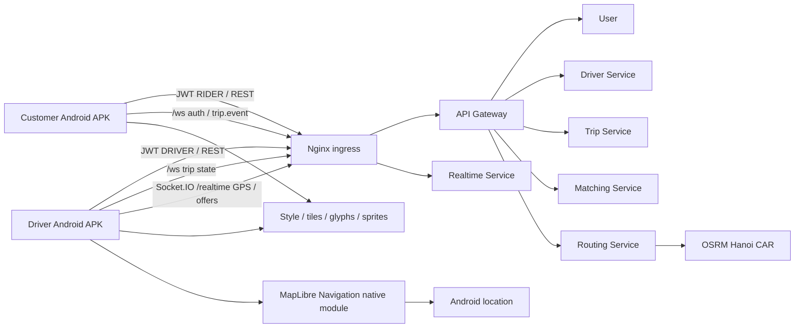
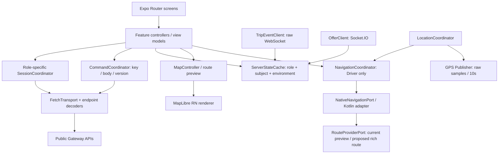

# Kiến trúc hai app Android

| Thuộc tính | Giá trị |
| --- | --- |
| Service | Customer App / Driver App |
| Rà soát | 2026-10-06 |
| Quy ước | [Format và số liệu](../quy-uoc-tai-lieu.md) |

## Trạng thái thực thi hiện tại

Các mô tả dưới đây là thiết kế đích. Đã triển khai từng phần kết nối trong app/; trạng thái, commit, kiểm thử và giới hạn APK/native được ghi tại [báo cáo thực thi](bao-cao-ket-noi.md). Shared-source Android variants hiện dùng com.chande.customer/com.chande.driver; workspace mobile riêng vẫn là đề xuất.

## Quyết định kiến trúc đề xuất

Hai APK độc lập: Velox Customer (com.chande.customer) và Velox Driver (com.chande.driver), chưa phải application ID đăng ký production. Cùng repo, tách navigation/auth/storage lifecycle; share pure contracts, transport primitives, design tokens, map render và native adapter. Không dùng một app chọn role để thay hai app người dùng yêu cầu.

Giữ base hiện có: Expo ~57.0.24, React Native 0.86.3, React 19.2.3, TypeScript ~6.0.3; Node 24. Đây là package.json checkout, không tự nâng/hạ xuống latest. MapLibre RN candidate v11 và native SDK pin chỉ sau Android Gradle/device spike. Expo Router dùng src/app; development build/APK, không nghiệm thu qua Expo Go. [Expo SDK57](https://docs.expo.dev/versions/v57.0.0/).

Đề xuất workspace mobile riêng để không kéo npm packages backend vào mobile dependency graph. Theo [Expo monorepos](https://docs.expo.dev/guides/monorepos/), workspace và Metro cần đồng nhất resolution. Đợt thiết kế chưa di chuyển app/ hoặc thay lockfile.

```text
mobile/
  package.json                 # private, workspaces apps/* và packages/*
  package-lock.json            # một lockfile mobile; React/RN/Expo không duplicate
  apps/
    customer-app/
      app.config.ts            # Android ID/scheme, native plugins
      src/app/                 # auth, home/pick-place, quote, active trip, history, account
      src/features/            # customer-auth, booking, trips, profile, addresses
      src/bootstrap/           # customer runtime, ports và capability config
    driver-app/
      app.config.ts
      src/app/                 # auth, dashboard, offer, active/navigation, history, profile/vehicles
      src/features/            # driver-auth, availability, offers, trips, navigation, gps
      src/bootstrap/           # driver runtime và authenticated coordinators
  packages/
    contracts/                 # wire DTO + decoders + status/error types; không React/native
    app-core/                  # HTTP, session primitives, commands, clock, event merge
    design-system/             # Inter, tokens, button/sheet/card/status/form
    maps/                      # renderer, coordinate/polyline6 codecs, route/marker/camera
    navigation-native/         # Expo Module Kotlin cho Android + TS port + config plugin
```

Generated apps/*/android không edit tay. Kotlin/module/config-plugin nằm trong package native do mình sở hữu; native generation/autolinking phải kiểm từ clean build. Chưa tạo ios hoặc làm web navigation. Demo Android thật/emulator; package customer không kéo Navigation SDK chỉ để hiển thị map.

## C4 container và C3 app





## Components và tiêu chí review

| Component | Trách nhiệm | Không sở hữu / nghiệm thu |
| --- | --- | --- |
| Screen/Router | Layout Stitch, params ID, user gestures | Không fetch trực tiếp, tính giá, chứa service credential hoặc tự chọn tài xế |
| CustomerBookingController | Input revision, preview/quote/type, create/cancel và hydrate active | Quote cũ không overwrite input mới; một active trip; lỗi mạng không tạo key mới |
| DriverDashboardController | Intent/selection/GPS/occupancy là state riêng | ONLINE không suy thành AVAILABLE; PENDING/UNKNOWN rõ ràng; thiếu selection cần chọn lại |
| OfferCoordinator | Version/expiry/decision pending, hydrate active/detail offer | Không tự accept, không reset 20s; ASSIGNED offer không mở popup như PENDING |
| SessionCoordinator | Single-flight refresh, epoch/logout, retry đúng realm | User và Driver auth adapters khác nhau; token issuer/aud sai không loop refresh vô hạn |
| Endpoint decoders | Unwrap User raw/Node envelope, normalize errors + requestId | Không dùng một parser bắt mọi body; 204 không JSON.parse; reject malformed response |
| CommandCoordinator | Persist intent/key/body/version cho uncertain write | Không frontend outbox auto-run background; không update version/key âm thầm |
| ServerStateCache | Query keys, in-flight dedupe, generation/version guard | Tách session/role/environment; logout purge; history cursors opaque, không fake tổng |
| TripEventClient | Raw /ws auth, keepalive, invalidation/refetch | Không GPS stream; replay/missing event không là state authoritative |
| DriverRealtimeClient | Socket.IO auth.token, GPS ACK, offer/updated, reconnect | Không truyền driverId/room; không gửi accept socket; không attach RIDER |
| LocationCoordinator | Một stream authoritative/raw location; provider switch lifecycle | GPS snapped chỉ UI/nav, không gửi server như raw accuracy; không duplicate publishers |
| MapController | Decode polyline6, [lng,lat], layers/camera/fit/sheet padding | Không directions/routing backend, không lấy tiles từ OSRM |
| NativeNavigationPort | Driver SDK start/stop/replace route, local progress/offRoute | Không Trip mutation, fare calculation hoặc private OSRM access từ mobile |

Dùng query/cache port trước; nếu chọn TanStack Query hoặc thư viện state mới thì khóa phiên bản và kiểm RN57/TS6 lúc khởi tạo. Không thêm library chỉ để thay primitives đã có.

## State và ownership

Customer booking UI: EDITING → ESTIMATING → QUOTED → CREATING_UNKNOWN → ACTIVE → TERMINAL. Quote, inputRevision, selected type là UI/local; Trip status/version và fares authoritative server. Refresh active ở startup/focus/reconnect trước cho đặt chuyến mới. Quote expired ở biên now >= expiresAt, quote dùng một lần; create replay dùng cùng key trước estimate lại khi kết quả chưa rõ.

Driver dùng ba máy trạng thái độc lập: availability intent/projection; offer lifecycle; Trip lifecycle. ACCEPT_PENDING/ASSIGNMENT_PENDING không phải nhận cuốc xong; ASSIGNED mới chuyển TO_PICKUP. DRIVER_ARRIVED chờ user START, IN_PROGRESS chuyển TO_DESTINATION, COMPLETED/CANCELLED đóng nav và offer view. Native onArrival chỉ gợi ý gesture, không PATCH tự động.

Mọi command chặn duplicate taps; serialize command mỗi Trip. 409 stale version: refetch → user xác nhận hành động mới → key mới nếu là intent mới. Network/timeout: giữ body/key/version, retry same intent; không silent refresh version rồi gửi lại hành động. 503/429 có backoff theo Retry-After; GET có thể retry hữu hạn; đăng ký/sửa xe non-idempotent đọc lại dữ liệu trước quyết định retry.

## Realtime và phục hồi

Mỗi app tối đa một TripEvent socket; Driver thêm một Socket.IO connection chia GPS và offers, không tạo socket cho từng màn. Foreground startup: restore refresh → get profile → active Trip → Driver availability/vehicles/active offer → open sockets → reconcile/refetch. UI route không giữ sole copy của Trip.

Trip events giữ eventId/tripVersion; stale/version gap hoặc reconnect thì GET active/detail. Receipt API replay có thể cũ hơn cache: giữ version cao hơn. Offer events dùng offerId/version, nhận current state khi cần; terminal tombstone không bị PENDING cũ hồi sinh. HTTP detail trả sau một mutation cũng phải qua version/generation guard.

Đề xuất fallback polling khi screen active/connection mất: Trip 5s, offer 5s, availability 10s; proposal không phải backend SLA. Không parallel GET cùng key, pause ngoài foreground, slow/backoff outage. App hiện tại poll Trip 15s có min10s: cần migration config riêng, không đổi env cũ âm thầm.

GPS publisher đặt ở authenticated app scope, không ở dashboard focus; tab history/profile không làm mất GPS khi ONLINE/active Trip. Theo JWT + permission + foreground + location quality; raw recordedAt, mỗi 10s, server TTL30s/future5s. Active assigned Trip có thể giữ GPS local/publish dù intent OFFLINE; không suy Trip kết thúc từ intent hoặc GPS TTL. Socket/GPS tạm dừng khi background/logout; không tự cancel/complete Trip. Khi chưa có background service, UI không hứa vẫn nhận cuốc/điều hướng khi khóa màn hình.

## Reuse app/ hiện có

| Code đã đối chiếu | Cách tận dụng ở feature triển khai |
| --- | --- |
| app/src/features/driver/session | Session single-flight/epoch/storage pattern; customer cần adapter phone/password và User raw body |
| driver/http, contracts, clients/trip-client | Transport/errors/Trip decoding/command pattern; mở service selection cho matching/routes/user, ưu tiên Gateway |
| driver/state/trip-command-manager | Replay intent key/body/version; review storage separation khi tách APK |
| driver/screens/vehicles/profile/history | Logic và forms làm nền; restyle theo Stitch, không giữ stub stats |
| clients/matching-client.ts | Hiện UnconfiguredMatchingClient; thay bằng GET offers + accept/decline theo contract đã có |
| realtime/realtime-client.ts | Hiện UnconfiguredRealtimeClient; tạo raw TripEvent + shared driver Socket.IO providers |
| gps/use-driver-gps.ts | Đã có publisher foreground 10s nhưng gắn screen focus; chuyển lifecycle lên app scope và single location authority |

Giữ app/ chạy được đến khi driver-app đã smoke tương đương, không reset-project/move/delete ngay. UI input/permissions/native dependencies không đi vào packages/contracts. Capability registry phân biệt backend-ready, native-spike, asset-config-required và skipped; các nút thiếu API không xuất hiện.
