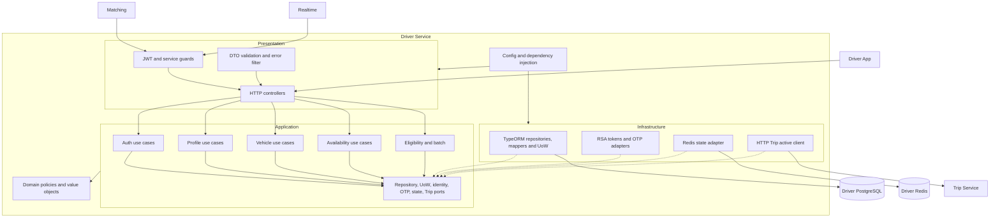
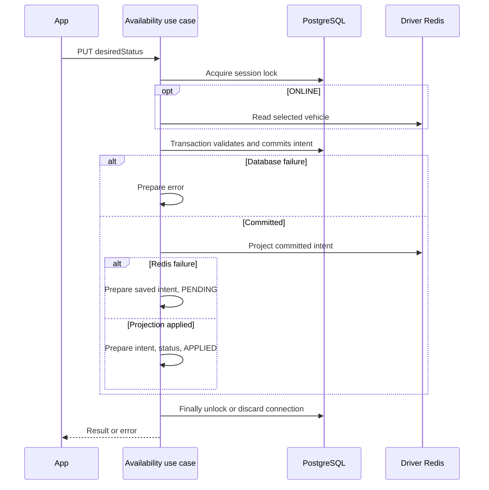

# Kiến trúc Driver Service

C3 theo layer và implementation hiện tại. [API](api.md), [Nghiệp vụ](nghiep-vu.md), [Deploy](deploy.md).

## 1. Container và ranh giới

Driver sử dụng PostgreSQL Driver, Redis Driver, OTP adapter và HTTP Trip Active. Realtime sử dụng JWKS/batch eligibility từ Driver, giữ GPS ở namespace Redis riêng. App Driver trong app/ gọi trực tiếp Driver/Trip/Realtime theo cấu hình. Gateway chính thức là dependency ingress tương lai, không phải nguồn Trip/Driver.

Driver không truy cập trip_db, không tạo Trip/Matching thay thế, không sở hữu reservation lock Matching.

## 2. C3 theo layer



Nét đứt biểu diễn adapter triển khai port. Controller không query ORM hoặc chứa nghiệp vụ chính. Application dùng Domain/port; Domain không import NestJS, TypeORM, Redis hay HTTP. Bootstrap nối concrete adapter. Context là điểm DI của Presentation; không dùng trong Domain/Application.

## 3. Cây mã và component

```text
src/
  presentation/http/
    controllers/
      auth.controller.ts
      profile.controller.ts
      vehicle.controller.ts
      availability.controller.ts
      internal.controller.ts
      realtime-internal.controller.ts
      operations.controller.ts
    dto/                   # auth/profile/vehicle/availability/eligibility/batch
    guards/                # user/service/realtime-service/client-address
    filters/error.filter.ts
    response.ts
    http.types.ts
  application/
    ports/                 # repositories, UoW, runtime, identity, OTP, state, Trip
    use-cases/
      auth/auth.use-cases.ts
      profile/{profile.use-cases,profile.dto}.ts
      vehicle/{vehicle.use-cases,edit.policy}.ts
      availability/availability.use-cases.ts
      eligibility/{eligibility.use-case,batch-eligibility.use-case}.ts
  domain/
    driver/{driver,status}.ts
    vehicle/{vehicle,vehicle.policy}.ts
    policies/{profile.policy,eligibility.policy,snapshots}.ts
    value-objects/
  infrastructure/
    persistence/
      entities/{driver,vehicle,driver-refresh-token}.entity.ts
      repositories/{driver,vehicle,refresh-token}.repository.ts
      repositories/schema.inspector.ts
      mappers/{driver,vehicle}.mapper.ts
      unit-of-work/postgres.store.ts
    auth/{rsa-tokens,runtime}.ts
    otp/{mock-otp,http-otp}.ts
    redis/redis-state.ts
    clients/trip-active.client.ts
  bootstrap/
    config/configuration.ts
    modules/{driver.module,driver-context}.ts
  main.ts
test/
  unit/
  contract/http.test.cjs
  integration/{database,redis}.test.cjs
  e2e/driver-http.test.cjs
  helpers/
```

Barrel index.ts phục vụ import/test, không phải implementation thứ hai. Test HTTP/e2e sử dụng port bộ nhớ; integration kiểm PostgreSQL/Redis riêng. Không còn test import Gateway demo hoặc frontend ngoài repository.

## 4. Persistence và transaction

Driver.desiredStatus ánh xạ drivers.status hiện có; Vehicle và DriverRefreshToken ánh xạ vehicles/driver_refresh_tokens. Không thêm bảng/cột/index/constraint/version hoặc đổi ID.

Startup inspector chỉ đọc metadata/status, kiểm type/length, nullable avatar/revoked và một số CHECK legacy. Nó không chứng minh đầy đủ default/unique/FK/index hay mọi dạng CHECK. Cần DDL có thẩm quyền để kiểm integration thật.

Refresh khóa token row; revoke/insert cùng transaction. Vehicle và profile writes dùng repository/UoW. PostgreSQL/Redis không có transaction chung hoặc outbox; crash/commit reply mất vẫn có kết quả không xác định.

## 5. Điều phối và projection

PostgresStore.coordinate dùng session advisory lock trên QueryRunner riêng, key hash driverId. Có FIFO local và polling acquire với DRIVER_LOCK_WAIT_MS; thời gian chờ FIFO local nằm ngoài timeout acquire. Khóa session tồn tại sau COMMIT tới khi HTTP/projection ngoài transaction hoàn tất.

Unlock trong finally trên đúng connection. Acquire reply mất, unlock lỗi/false hoặc transaction chưa kết thúc: discard connection qua TypeORM PostgreSQL, không trả connection còn khóa về pool. Row lock riêng chỉ giữ trong transaction ghi. Không giữ transaction ghi để chờ HTTP/Redis, không lấy lock Matching.

Writer Driver tuân coordinator; writer operational từ service khác chưa cùng protocol. Một lần GET Trip active không loại bỏ race assignment. Cần Matching/Trip/Gateway thống nhất fencing/lease/state ownership trước khi tuyên bố an toàn nhiều writer.



## 6. Redis ownership

| Key/field | Writer hiện tại | Giới hạn |
| --- | --- | --- |
| driver:{id}:availability STRING | Driver từ PG | Projection ONLINE/OFFLINE, không phải nguồn ý định |
| driver:{id}:state.vehicle_id HASH | Driver select/clear | Không có cột selected_vehicle_id; mất cache phải chọn lại |
| state.status | Driver vô hiệu hóa trạng thái cũ/ghi OFFLINE, bảo toàn BUSY | AVAILABLE/BUSY cần producer chính thức đối soát Trip; thiếu field trả UNKNOWN |
| state.last_seen/vehicle_type | Driver xóa khi OFFLINE | Driver không tạo GPS/presence |
| drivers:locations:last_seen, drivers:geo:{type} | Driver chỉ ZREM khi clear/OFFLINE | Key legacy giữ cleanup tương thích; không còn Gateway demo producer |
| driver:{id}:lock | Matching | Driver không tạo/xóa/chiếm lock |
| realtime:{gps}:* | Realtime | Namespace riêng; xem tài liệu Realtime, Driver không ghi |

HASH state không TTL toàn key để tránh làm mất BUSY/selection do GPS expiry. ONLINE không ghi AVAILABLE. Không dual-write GEO legacy và Realtime. Redis Cluster cần đánh giá lại multi-key Lua Driver vì key legacy không cùng hash tag; chưa nghiệm thu cluster.

## 7. Contract cần phối hợp

Trip nhận JWT DRIVER do issuer Driver cấp qua JWKS; URL direct không prefix mặc định. Không có lookup driverId bằng service credential. App TripClient tương thích cả Idempotent-Replay trong code Trip và Idempotency-Replayed trong tài liệu Trip, vẫn kiểm version; chưa chốt tên header chung.

Realtime batch dùng credential riêng, khác Matching token. GPS ACK chỉ xác nhận thao tác Redis, không chứng minh đủ điều kiện nhận cuốc hoặc persistence qua failover.

Gateway chính thức cần proxy path/envelope/status/headers, chuyển tiếp Authorization và Idempotency-Key, hạn chế internal endpoints, namespace Socket.IO/CORS, nguồn vận hành AVAILABLE/BUSY và resync active Trip. Không cần sao chép Gateway demo; durable event delivery chưa thuộc implementation Driver/Realtime hiện tại.
