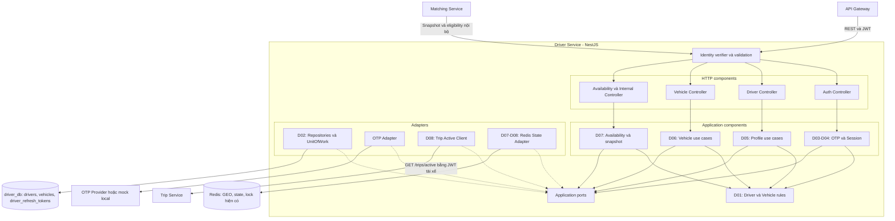
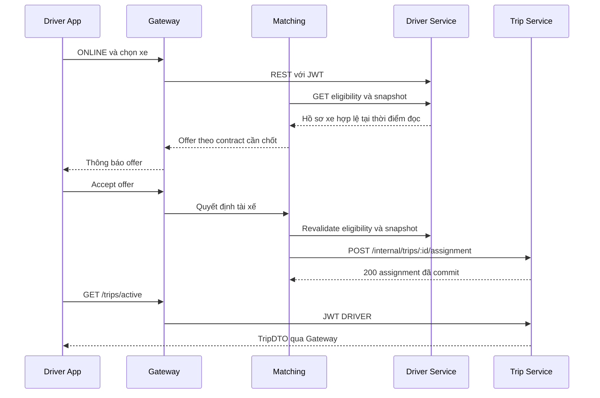

# Kiến trúc Driver Service

Ngày 05/10/2026; phiên bản 0.1 draft, chưa triển khai. [Nghiệp vụ](nghiep-vu.md), [API](api.md), [Routes](routes.md), [Deploy](deploy.md).

## 1. Ràng buộc thiết kế

Giữ nguyên database ERD, không thêm bảng/cột/index. Không sao chép schema outbox/receipt của Trip sang Driver. Source-of-truth Trip là service khác, không join xuyên database. Dùng REST và các adapter rõ ranh giới; không thêm message broker vào baseline.

Driver hỗ trợ US19/20/23/28. Các component phục vụ Trip/Matching chỉ cung cấp dữ liệu hoặc đọc trạng thái, không sở hữu vòng đời chuyến. Gateway giữ kênh realtime; không xem Redis là bằng chứng assignment đã commit.

## 2. C3 Driver Service

Component được nhóm theo trách nhiệm. Các box ngoài Driver là container/service phụ thuộc. Mũi tên là lời gọi, không đồng nghĩa mọi lời gọi nằm trong cùng transaction.



Guard chọn cơ chế theo route: OTP public có rate limit; me có JWT DRIVER; internal có service credential; JWKS chỉ trả public keys. Adapters triển khai ports; composition root nối dependency, không import TypeORM/Nest vào Domain.

Không vẽ Trip Event Handler nhận event trực tiếp trong Driver baseline: draft Trip chỉ có đích Gateway/Notification. Không có outbox publisher Driver vì không có nơi lưu outbox theo ràng buộc schema.

## 3. Lớp và cấu trúc dự kiến

| Lớp | Trách nhiệm | Giới hạn |
| --- | --- | --- |
| Domain | Canonical phone, quyền sở hữu, xe hợp lệ, ý định nhận cuốc | TypeScript thuần, không HTTP/ORM |
| Application | Auth/profile/vehicle/availability/snapshot; transaction boundary | Dùng ports và domain |
| Infrastructure | ORM mapping, JWT/OTP, Redis, Trip HTTP client | Không tự thêm chính sách Trip |
| Presentation | DTO, guard, response/error mapper | Không tin actor từ body |
| Bootstrap | Config, concrete adapter, startup validation | Mock chỉ dev/test |

```text
service/driver-service/
  README.md
  docs/                     # Các file trong đợt này
  src/                      # Dự kiến, chưa tạo
    domain/
    application/use-cases/
    application/ports/
    infrastructure/persistence/
    infrastructure/auth/
    infrastructure/otp/
    infrastructure/redis/
    infrastructure/clients/
    presentation/http/
    bootstrap/
    main.ts
  test/                     # Dự kiến, chưa tạo
```

Không có worker/outbox entry point tương tự Trip. Reconcile cache có thể là task runtime, nhưng chỉ sửa ý định/xe đã biết; không truy vấn Trip theo ID bằng route không tồn tại.

## 4. Ports

| Port | Chữ ký khái niệm | Sử dụng |
| --- | --- | --- |
| DriverRepository | findById/phone, updateProfile, setStatus, lockById | Profile/Auth/Availability |
| VehicleRepository | findOwned, listOwned, create, update | Vehicle/Snapshot |
| RefreshTokenRepository | findByHash, lock, insert, revoke | Session |
| UnitOfWork | execute repositories trên cùng manager | Rotation và DB writes |
| OtpVerifier | request, verifyAndConsume | Auth |
| TokenIssuer / IdentityVerifier | sign / verify, publicKeySet | JWT contract |
| DriverStateStore | getSelectedVehicle, setSelection, reconcileIntent | Availability |
| TripActiveClient | getActiveForPrincipal(delegatedAccessToken) | Kiểm tra user-initiated mutations |
| Clock / IdGenerator | serverNow, UUID | Use case có fake test |

Token chỉ được truyền ngắn hạn đến Trip trong lời gọi người dùng, không lưu/log hay dùng cho job nền. Cùng issuer/audience phải được Trip hỗ trợ; nếu chưa chốt trust thì adapter chưa tích hợp thật.

## 5. Mapping schema giữ nguyên

| Table | Cột theo ảnh ERD |
| --- | --- |
| drivers | id UUID; phone_number VARCHAR(15) unique; password_hash VARCHAR(255); full_name VARCHAR(100); avatar_url TEXT; license_number VARCHAR(20) unique; status VARCHAR(20); created_at/updated_at TIMESTAMPTZ |
| vehicles | id UUID; driver_id UUID FK; vehicle_type VARCHAR(20); license_plate VARCHAR(15) unique; brand_model VARCHAR(100); color VARCHAR(30); is_active BOOLEAN; created_at TIMESTAMPTZ |
| driver_refresh_tokens | id UUID; driver_id UUID FK; token_hash VARCHAR(64) unique; expires_at/revoked_at/created_at TIMESTAMPTZ |

Ảnh không xác định đủ NOT NULL/default/check. DDL thật là gate trước Entity. Không thêm phone_verified_at, account_status, selected_vehicle_id, version hay vehicles.updated_at. Không viết migrations làm schema mới trong đợt tài liệu này.

Ứng dụng serialize camelCase nhưng mapping đúng snake_case. Token hash 64 ký tự hex cho token entropy cao; không dùng hash token này thay cơ chế hash mật khẩu. password_hash giữ nguyên dù OTP không dùng nó.

VehicleType Driver giới hạn 20 theo ERD; Trip draft cho phép 32. Dùng tập mã chung tối đa 20; không tăng cột hoặc truncate. licensePlate tối đa 15 dù Trip snapshot nhận 32; color tối đa 30 dù Trip nhận 100. brand_model map thành brand trong snapshot; không tự tách nhãn hiệu/model từ chuỗi tự do.

## 6. Redis và ownership

| Key hiện có | Vai trò | Ownership đề xuất |
| --- | --- | --- |
| drivers:geo:{vehicle_type} | Tọa độ ứng viên | Gateway ghi GPS; Matching đọc; trạng thái chỉ là bộ lọc |
| driver:{id}:state | HASH status, vehicle_id | Driver ghi selection/ý định; Gateway cập nhật projection liên Trip theo giao thức đã chốt |
| driver:{id}:lock | STRING NX EX 30 theo ERD | Matching dùng reservation ngắn hạn; value là token sở hữu |

Hai writer trên state cần dùng Redis operation nguyên tử theo field và quy tắc chuyển trạng thái; không DEL/HSET toàn hash khiến xóa vehicle_id hoặc ghi đè BUSY. Driver đổi ONLINE không tự ghi AVAILABLE nếu chưa có bằng chứng presence/Trip; Gateway nhận event kết thúc không tự ghi AVAILABLE khi driver đã OFFLINE. Khi không đủ bằng chứng, dùng OFFLINE như trạng thái không chọn được, không suy ra chuyến không tồn tại.

TTL/presence là đề xuất vận hành, chưa có hợp đồng Gateway trong ZIP. Không nhận ACK trống rồi coi đã có GPS. GEO không có TTL riêng cho từng member: cleanup và kiểm tra state/presence trước mời là bắt buộc. Xóa reservation phải compare token sở hữu; hết TTL không chứng minh chuyến đã kết thúc. Không đổi key lock thành dữ liệu active-trip bền vững.

## 7. Transaction và failure semantics

- Session rotate: khóa row refresh token → kiểm tra → revoke cũ/insert mới → commit. Không gọi OTP/SMS/Trip trong transaction này.
- Profile/vehicle/status: transaction DB ngắn; unique constraint hiện có bảo vệ trùng. Không dùng read-then-insert một mình để bảo đảm uniqueness.
- HTTP Trip check trước DB transaction; recheck local owner/status trong transaction. Không có atomic check xuyên service; race assignment được mô tả trong Nghiệp vụ.
- PostgreSQL + Redis không commit cùng nhau. Response phân biệt desiredStatus đã lưu với realtimeSync APPLIED/PENDING. APPLIED chỉ ghi cache xong, không có nghĩa app đã nhận hay tài xế chắc chắn được ghép.
- Reconcile phải đọc trạng thái DB mới nhất, không replay một giá trị stale từ request cũ. Các lần reconcile cùng tài xế cần được serialize bằng cơ chế runtime được duyệt; không sử dụng lock của Matching cho mục đích khác.
- Không durable Driver event trong baseline. Để yêu cầu đúng-bền-vững như Trip outbox cần thay thiết kế hoặc dùng hạ tầng ngoài được phê duyệt; chưa tuyên bố đã có.

## 8. Phối hợp Trip và Gateway



Callback có eventId chống lặp. Trip có thể trả ACK replay khi chuyến đã kết thúc; Matching phải giữ terminal marker theo tài liệu Trip, không mở lại reservation từ ACK cũ.

## 9. App: thực trạng và kế hoạch

Đã đọc package.json, src/app/index.tsx, explore.tsx, _layout.tsx, tabs và tìm kiếm app/src. Chỉ starter Expo; không có store phiên, API client hoặc socket nghiệp vụ. Kế hoạch: AuthClient/DriverClient/TripClient/MatchingClient tách endpoint; global xử lý envelope; serialize refresh; giữ Idempotency-Key cho retry Trip; đọc lại version khi 409; UI không lùi từ response replay cũ.

Sau reconnect GET /trips/active; GET /trips/:id có data.trip và statusHistory, khác data trực tiếp của active/status. Route history trả data.items/nextCursor. Driver App chưa được sửa trong đợt này.

## 10. Kiểm chứng kiến trúc

Schema diff rỗng; không truy cập trip_db; không public internal API; state mất không tạo assignment; token Driver được Trip xác minh; snapshot đúng field/độ dài; không có endpoint thống kê/chat giả; race và giới hạn DB/Redis được công bố. Các kiểm chứng backend là kế hoạch, chưa chạy khi không có code.
