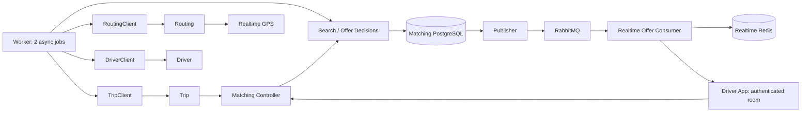

# Kiến trúc Matching v1

| Thuộc tính | Giá trị |
| --- | --- |
| Service | matching-service |
| Rà soát | 2026-10-06 |
| Quy ước | [Format và số liệu](../../../docs/quy-uoc-tai-lieu.md) |

Controller xác thực/validate/correlation; domain giữ chuyển trạng thái và ranking; application điều phối HTTP ngoài transaction; persistence lưu search/offer/reservation/receipt/outbox. Database constraints bảo vệ một reservation/driver và một offer chờ/trip. Worker lease có hạn để phục hồi process chết, khác reservation nghiệp vụ.

Trip là nguồn xác nhận assignment. Callback 202 nghĩa assignment đã commit; response mất được đối soát qua matching-state. Không giải phóng reservation pending chỉ vì deadline HTTP. Terminal marker và idempotency receipt được lưu bền vững.

RabbitMQ durable exchange/queue, persistent message, publisher confirms và mandatory routing. Consumer ACK sau cache/kiểm tra trạng thái/attempt phát. Retry có backoff, malformed đi DLQ. Redis giữ version/tombstone để message đảo thứ tự không hồi sinh offer. Reconnect truy vấn Matching trước phát lại.

Broker confirm xác nhận broker nhận message, không chứng minh Driver App đã nhận; ứng dụng deduplicate theo offer ID/version và lấy lại trạng thái khi reconnect. Tham chiếu [RabbitMQ acknowledgements/confirms](https://www.rabbitmq.com/docs/confirms) và [amqplib Channel API](https://amqp-node.github.io/amqplib/channel_api.html).

Một process API, một process worker, một Realtime replica v1. Shutdown ngừng nhận job rồi chờ I/O có timeout; khởi động lại xử lý offer quá hạn và outbox chưa ACK.

| Component | Input → output | Kiểm chứng và mã nguồn |
| --- | --- | --- |
| API | Trip command/JWT decision → durable ACK/status | strict body, caller scope, ownership/idempotency; src/api/app.ts |
| Domain | search/offer/clock → transition/ranking | deadline đúng biên, terminal không mở lại, sort ổn định; src/domain/models.ts |
| MatchDriver | search → một offer/reservation | matrix driver→pickup, freshness/tried/busy, transaction cạnh tranh; application/match.ts |
| OfferDecisions | driver/key/action → receipt | accept chưa phải assigned; decline giải phóng và tìm tiếp; application/decisions.ts |
| AssignDriver | frozen event/snapshot → Trip confirmation | uncertain callback giữ reservation, cancel không mở lại; application/decisions.ts |
| Clients | ports → Routing/Driver/Trip HTTP | timeout, redirect error, schema/identity/ACK, response cap; infrastructure/clients.ts |
| Repository | aggregate → PostgreSQL | unique active offer/reservation, receipt, terminal marker, lease; infrastructure/persistence.ts |
| Worker / expiry | due jobs/expired offers → bounded processing | hai job, lease renewal/backoff; expiry độc lập I/O; application/worker.ts và expiry.ts |
| Publisher | outbox → confirmed Rabbit message | persistent/mandatory/confirm; cùng ID khi retry; infrastructure/publisher.ts |
| Realtime consumer | Rabbit/current offer → Redis/driver room | manual ACK, backoff/DLQ, version/tombstone, reconnect; realtime-service/src/infrastructure/offers/consumer.ts |

Reservation không hết hạn theo worker lease. Offer có `assignmentAttempted` trong JSON để lần retry sau timeout không đánh giá lại Driver rồi tự giải phóng khi callback cũ có thể vẫn commit. HTTP chạy ngoài transaction; transaction recheck search/offer trước gửi/lưu kết quả. Expiry sweep dùng cùng thứ tự lock search→offer như accept/cancel.
