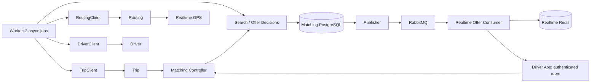

# Kiến trúc Matching v1

Controller xác thực/validate/correlation; domain giữ chuyển trạng thái và ranking; application điều phối HTTP ngoài transaction; persistence lưu search/offer/reservation/receipt/outbox. Database constraints bảo vệ một reservation/driver và một offer chờ/trip. Worker lease có hạn để phục hồi process chết, khác reservation nghiệp vụ.

Trip là nguồn xác nhận assignment. Callback 202 nghĩa assignment đã commit; response mất được đối soát qua matching-state. Không giải phóng reservation pending chỉ vì deadline HTTP. Terminal marker và idempotency receipt được lưu bền vững.

RabbitMQ durable exchange/queue, persistent message, publisher confirms và mandatory routing. Consumer ACK sau cache/kiểm tra trạng thái/attempt phát. Retry có backoff, malformed đi DLQ. Redis giữ version/tombstone để message đảo thứ tự không hồi sinh offer. Reconnect truy vấn Matching trước phát lại.

Một process API, một process worker, một Realtime replica v1. Shutdown ngừng nhận job rồi chờ I/O có timeout; khởi động lại xử lý offer quá hạn và outbox chưa ACK.
