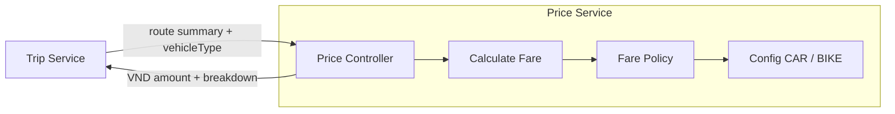

# Price Service v1 — mở cửa và cước theo quãng đường

Cập nhật 06/10/2026: P00–P02 đã có runtime config/domain/use case và NestJS HTTP; [API](api.md) là contract triển khai. Docker và tests đã có; tích hợp Trip được kiểm tra ở suite cross-service của Trip. Các feature bên dưới giữ vai trò kế hoạch/tiêu chí đối chiếu.

## 1. Đã xác nhận và đề xuất

Người dùng muốn tính đơn giản nhất, kiểu giá mở cửa taxi, có CAR và BIKE, nhận kết quả tuyến để tính tiền. C3 cung cấp gồm Price Controller → Calculate Fare → Fare Policy, nhận Distance từ Trip. Người dùng cũng nhắc ETA; cần phân biệt:

- `distanceMeters`: quãng đường pickup → destination, dùng tính cước/km.
- `durationSeconds`: thời gian dự kiến của chính tuyến đó. Đề xuất v1 nhận để tương thích Trip nhưng chưa tính cước thời gian.
- ETA driver → pickup trong Routing Matrix là thời gian tài xế đến đón; không tự dùng nó làm cước tuyến khách đi.

Người dùng cho phép đặt giá mẫu tùy chọn và yêu cầu giữ các thuộc tính chỉnh sửa được. Mặc định thiết kế theo quãng đường trong C3; không tính phụ phí ETA. Giá mẫu bao gồm 1 km đầu; cách tính theo phút và cách làm tròn khác vẫn là lựa chọn cần review nếu muốn đổi chính sách.

## 2. Phép tính đề xuất

Mỗi loại xe chỉ cần ba giá trị cấu hình: giá mở cửa, số mét bao gồm trong giá mở cửa, đơn giá/km cho phần vượt. Không cần nhiều tiers, surge, chờ xe hoặc phí hủy trong v1.

```text
excessMeters = max(0, distanceMeters - includedDistanceMeters)
distanceFareVnd = ceil(excessMeters × pricePerKmVnd / 1000)
totalFareVnd = openingFareVnd + distanceFareVnd
```

Tính tỷ lệ theo mét và làm tròn lên đến 1 VND ở dòng cước quãng đường; không tự làm tròn lên cả kilomet. Nếu giá mở cửa không bao gồm km đầu thì đặt `includedDistanceMeters=0`. Nếu chỉ muốn giá cố định theo CAR/BIKE thì đặt `pricePerKmVnd="0"`. Các lựa chọn này cần validate trước khi bật real.

Tiền là số nguyên VND, lưu/serialize dưới dạng chuỗi thập phân và tính bằng `BigInt`; không dùng số thực cho tiền. Giá/đơn giá trong config là chuỗi số nguyên không âm, khoảng cách là số nguyên mét. Config thiếu/`null`, loại xe chưa cấu hình, input âm/nonfinite/overflow đều phải báo lỗi; không tự chọn giá mặc định hoặc fallback CAR cho BIKE.

| Loại xe | Giá mở cửa | Mét bao gồm | Đơn giá/km vượt | Ví dụ 4 km |
| --- | --- | --- | --- | --- |
| CAR | 12.000đ | 1.000 m | 10.000đ | 42.000đ |
| BIKE | 8.000đ | 1.000 m | 4.000đ | 20.000đ |

Ba thuộc tính `openingFareVnd`, `includedDistanceMeters`, `pricePerKmVnd` nằm trong [config](../config/fare-policy.example.json), không hard-code trong công thức. Trong runtime dự kiến, `FarePolicy` nhận config qua constructor; hàm cập nhật sau này validate cấu hình mới rồi thay policy snapshot atomically. Request lấy một snapshot duy nhất cho cả phép tính; đổi biểu giá không làm đổi quote đã lưu ở Trip.

## 3. Contract tương thích Trip

Trip đã có [PricingClient](../../trip-service/src/infrastructure/clients/pricing.ts) gọi `POST /internal/fares/estimate`, khác tên `/fare/calculate` trong C3. Đề xuất triển khai endpoint hiện có để giữ tích hợp đơn giản; không thêm alias khi chưa có consumer cần nó.

```json
{
  "route": {"distanceMeters": 4000, "durationSeconds": 600},
  "vehicleType": "CAR"
}
```

Header `X-Service-Token` riêng cho Trip và `X-Request-Id` UUID. Response shape:

```text
{
  data: {
    currency: "VND",
    amount: "<openingFareVnd + distanceFareVnd>",
    breakdown: [
      {code: "BASE_FARE", amount: "<openingFareVnd>"},
      {code: "DISTANCE_FARE", amount: "<distanceFareVnd>"}
    ]
  },
  meta: {requestId: "<UUID>"}
}
```

Đây là minh họa shape, không phải JSON chứa giá thật. `amount` và tổng breakdown phải bằng nhau, không vượt 9223372036854775807 VND theo [Trip validator](../../trip-service/src/domain/quote.ts). Không thêm fields vào `data` mà không đổi contract vì Trip dùng strict schema. Trong giai đoạn mock, `MOCK_BIKE` phải có cấu hình explicit riêng nếu cần; không tự coi nó là BIKE real.

Trip giữ quote 5 phút và giữ giá đã chốt khi tạo chuyến. Price tính toán thuần, không giữ/consume quote hoặc tính lại tiền khi Routing reroute. Chính sách final fare bằng giá đã chốt v1 vẫn thuộc Trip.

## 4. Component



| Component | Trách nhiệm | Nghiệm thu |
| --- | --- | --- |
| Price Controller | Token, strict DTO, requestId, envelope/error mapping | Sai quyền/schema không gọi Calculate Fare; HTTP 200 đúng Trip contract |
| Calculate Fare | Chọn policy đúng vehicleType, gọi phép tính, trả breakdown | CAR/BIKE độc lập, không fallback; cùng input/config cùng output |
| Fare Policy | Giá mở cửa + phần quãng đường vượt; overflow và integer rounding | Tại 0 mét, đúng ngưỡng, vượt ngưỡng 1 mét, không thu thời gian ở distance mode |
| Config loader | Validate biểu giá khi startup, giữ config snapshot immutable | Thiếu/âm/overflow lỗi; giá mẫu chỉ dùng phát triển trước khi chốt biểu giá kinh doanh |

## 5. Feature nhỏ đề xuất

1. P00: package/config loader và bảng giá CAR/BIKE; test thiếu giá/định dạng/overflow.
2. P01: pure Fare Policy và Calculate Fare; test dưới/đúng/trên ngưỡng, fractional-km rounding, zero/overflow và loại xe.
3. P02: NestJS controller/DTO/auth/error handling; test strict shape và scope.
4. P03: dùng PricingClient/EstimateTrip thật qua HTTP; quote/fare breakdown/TTL vẫn đúng.
5. P04: Docker/CI/deploy/smoke và báo cáo commit/test.

Mỗi feature có test và commit/push riêng theo quy trình hiện có. Có thể triển khai với giá mẫu người dùng đã cho phép; biểu giá kinh doanh chốt trước production. Không cần queue, worker, outbox, database hoặc gọi OSRM từ Price để thực hiện phép tính này.
