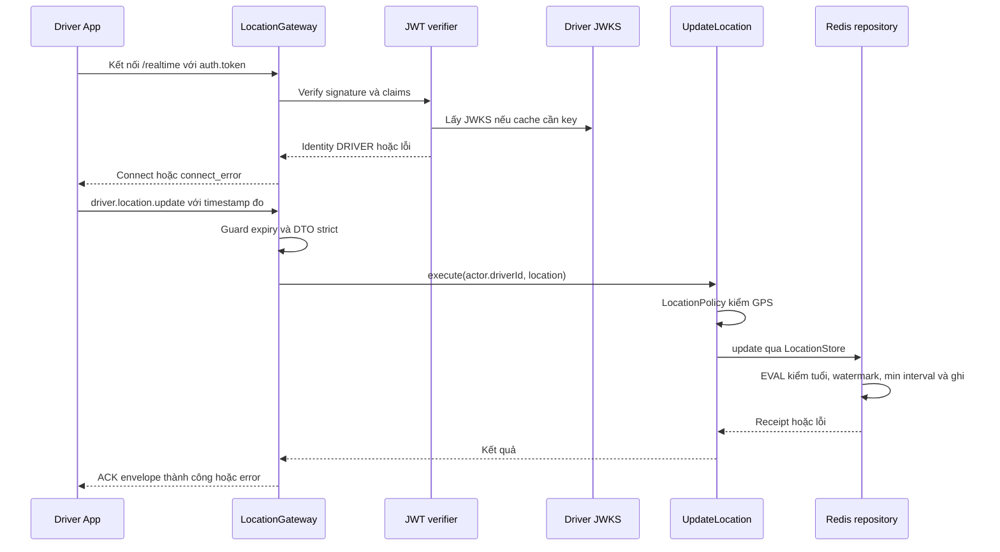
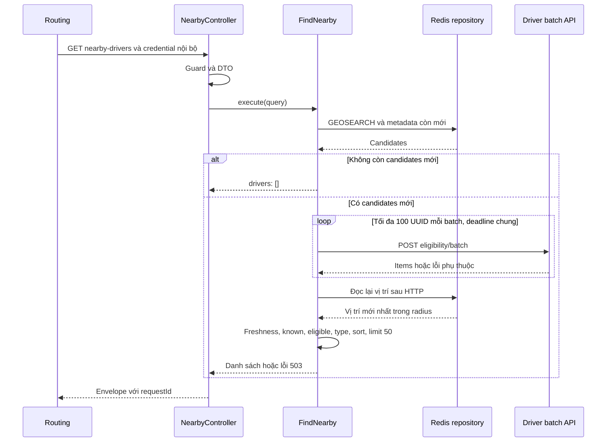

# Kiến trúc Realtime Service

Ngày đối chiếu mã: 06/10/2026. C3 dưới đây mô tả implementation hiện tại, không xác nhận đã vận hành nhiều instance. [Nghiệp vụ](nghiep-vu.md), [API](api.md), [Routes](routes.md), [Deploy](deploy.md).

## 1. Phạm vi và cách đọc

Realtime nhận GPS tài xế và cung cấp nearby cho Routing. Driver cấp identity/eligibility, Redis giữ GPS của Realtime. Không có PostgreSQL, Trip client, Matching client, broker hoặc Gateway demo dependency trong Realtime.

Mũi tên liền thể hiện lời gọi lúc chạy; mũi tên nét đứt từ adapter đến port thể hiện triển khai interface. Bootstrap nối dependency, không phải một bước nghiệp vụ bắt buộc sau Infrastructure. Application/Domain dùng TypeScript thuần, không import NestJS, ioredis, jose hay HTTP client.

## 2. C3 theo layer

```mermaid
flowchart TB
    App["Driver App - Expo foreground GPS"]
    Routing["Routing Service - caller nội bộ"]

    subgraph RT["Container: Realtime Service - NestJS"]
        direction TB
        subgraph P["Layer 1: Presentation"]
            Gateway["LocationGateway - Socket.IO"]
            Nearby["NearbyController - HTTP"]
            Health["HealthController - probes"]
            Guards["DriverSocketGuard / RoutingServiceGuard"]
            DTO["LocationDto / NearbyDto / ErrorFilter"]
        end
        subgraph A["Layer 2: Application"]
            Update["UpdateLocation"]
            Find["FindNearby"]
            Clean["CleanupStale"]
            Ports["Ports: LocationStore / EligibilityProvider / TokenVerifier"]
        end
        subgraph D["Layer 3: Domain"]
            Model["DriverLocation / LocationReceipt / NearbyLocation"]
            Policy["LocationPolicy / NearbyPolicy / RealtimeError"]
        end
        subgraph I["Layer 4: Infrastructure"]
            Store["RedisLocationRepository + Lua"]
            Client["DriverEligibilityClient"]
            Verify["JwksTokenVerifier"]
            Scheduler["CleanupScheduler"]
        end
        subgraph B["Bootstrap"]
            Config["loadConfig / RealtimeModule"]
            SocketAdapter["RealtimeSocketAdapter - origins"]
        end
        Gateway --> Guards
        Nearby --> Guards
        Gateway --> DTO
        Nearby --> DTO
        Gateway --> Update
        Nearby --> Find
        Health --> Ports
        Gateway -->|"Handshake verifier"| Ports
        Update --> Policy
        Find --> Policy
        Policy --> Model
        Update --> Ports
        Find --> Ports
        Clean --> Ports
        Store -.->|"Triển khai"| Ports
        Client -.->|"Triển khai"| Ports
        Verify -.->|"Triển khai"| Ports
        Scheduler --> Clean
        Config -.->|"DI / cấu hình"| A
        Config -.->|"Khởi tạo adapter"| I
        Config -.-> SocketAdapter
    end

    Driver["Driver Service - batch eligibility và JWKS"]
    Redis[("Redis của Realtime - realtime:{gps}:*")]
    App -->|"JWT / driver.location.update"| Gateway
    Routing -->|"HTTP / X-Service-Token"| Nearby
    Client -->|"POST eligibility/batch"| Driver
    Verify -->|"GET JWKS khi cần key"| Driver
    Store -->|"EVAL / GEO / HASH / ZSET"| Redis
```



Guards không truy vấn PostgreSQL. Xác thực socket ban đầu nằm trong middleware do LocationGateway đăng ký; DriverSocketGuard kiểm identity/expiry trên từng event. RoutingServiceGuard kiểm credential được inject. DTO/error mapping thuộc Presentation; health dùng LocationStore.ready, không truy cập Redis client trực tiếp.

### Component và dependency thực tế

| Layer | Component / file dưới src | Trách nhiệm | Dependency |
| --- | --- | --- | --- |
| Presentation | presentation/socket/location.gateway.ts | Namespace, auth middleware, DTO, ACK và disconnect cleanup | TokenVerifier, UpdateLocation, DriverSocketGuard |
| Presentation | presentation/socket/guards/driver-socket.guard.ts | Actor từ socket session, kiểm expiry | DriverIdentity trong port |
| Presentation | presentation/http/controllers/nearby.controller.ts | GET nội bộ, query và envelope | FindNearby, RoutingServiceGuard |
| Presentation | presentation/http/controllers/health.controller.ts | live và Redis readiness | LocationStore |
| Presentation | Các dto, response.ts, filters/error.filter.ts | Kiểu input, whitelist, requestId, HTTP/error mapping | class-validator/class-transformer, RealtimeError |
| Application | use-cases/update-location.ts | Validate domain rồi ghi store | LocationPolicy, LocationStore |
| Application | use-cases/find-nearby.ts | Hai lần đọc GPS, batch eligibility, lọc/sort/limit | LocationStore, EligibilityProvider, hai policy |
| Application | use-cases/cleanup-stale.ts | Yêu cầu dọn dữ liệu | LocationStore |
| Domain | location/driver-location.ts | Input, thời gian đo/nhận, distance, receipt | TypeScript thuần |
| Domain | policies/location.policy.ts | Tọa độ, accuracy, stale/future, freshness hai timestamp | RealtimeError |
| Domain | policies/nearby.policy.ts | BIKE/CAR_4/CAR_7, radius 1–2.000, tối đa 50 | RealtimeError |
| Infrastructure | redis/redis-location.repository.ts, location.scripts.ts | Adapter port, metadata mapping, EVAL và PING | ioredis, RedisConnection |
| Infrastructure | clients/driver-eligibility.client.ts | Batch HTTP, deadline và validate response | fetch/AbortSignal, Driver API |
| Infrastructure | auth/jwks-token.verifier.ts | JWT RS256 qua remote JWKS | jose |
| Infrastructure | scheduling/cleanup.scheduler.ts | Timer, không tick chồng, shutdown cleanup | CleanupStale |
| Bootstrap | config/configuration.ts, modules/realtime.module.ts, socket.adapter.ts | Config, provider factory, origins | Adapter cụ thể và NestJS |

Socket adapter nằm trong Bootstrap theo cây hiện có vì do main.ts cài vào Nest lúc khởi động. Không có OpenAPI/Swagger hoặc worker.ts riêng cho Realtime.

## 3. Cấu trúc code thực tế

```text
service/realtime-service/
  README.md
  docs/{nghiep-vu,kien-truc,api,routes,deploy}.md
  src/
    presentation/
      http/
        controllers/{nearby,health}.controller.ts
        dto/nearby.dto.ts
        guards/routing-service.guard.ts
        filters/error.filter.ts
        response.ts
      socket/
        location.gateway.ts
        dto/location.dto.ts
        guards/driver-socket.guard.ts
    application/
      ports/{location-store,eligibility-provider,token-verifier}.port.ts
      use-cases/{update-location,find-nearby,cleanup-stale}.ts
    domain/
      location/driver-location.ts
      policies/{location,nearby}.policy.ts
      errors.ts
    infrastructure/
      auth/jwks-token.verifier.ts
      clients/driver-eligibility.client.ts
      redis/{redis.connection,redis-location.repository,location.scripts}.ts
      scheduling/cleanup.scheduler.ts
    bootstrap/
      config/configuration.ts
      modules/realtime.module.ts
      socket.adapter.ts
    main.ts
  scripts/send-location.mjs
  .env.example
  .gitignore
  package.json
  tsconfig.json
  eslint.config.cjs
```

Chưa có thư mục test hoặc Dockerfile/Compose/lockfile trong Realtime. Các thư mục hiện có đều có trách nhiệm thực tế. Tên file đầy đủ ở bảng component có thể dùng để lần từ route sang use case/adapter.

## 4. Port và composition root

| Port | Phương thức | Adapter |
| --- | --- | --- |
| LocationStore | update(driverId, location), nearby(query), cleanup(), ready() | RedisLocationRepository |
| EligibilityProvider | find(driverIds, vehicleType?) | DriverEligibilityClient |
| TokenVerifier | verify(token) → DriverIdentity {driverId, expiresAt} | JwksTokenVerifier |

RealtimeModule dùng factory provider để truyền config và port vào use case thuần. main.ts đọc dotenv, tạo Nest, middleware requestId/no-store, body limit 8 KB, global HTTP validation/filter, Socket adapter và shutdown hooks; listen trên 0.0.0.0 ở PORT. Không có global /api/v1 prefix.

## 5. Sequence nhận GPS



JWT xác minh lúc handshake; event dùng identity đã gắn và expiry check. Không gọi JWKS trên mọi event. Socket.IO ACK không phải HTTP response và không bảo đảm lưu bền Redis/assignment.

## 6. Redis, thứ tự và cleanup

Năm key dưới đây hardcode trong RedisLocationRepository, cùng hash tag {gps}; chỉ Realtime ghi. Không có key theo vehicleType: loại xe được lấy khi kiểm eligibility.

| Key | Kiểu / member | Writer và reader |
| --- | --- | --- |
| realtime:{gps}:geo | GEO ZSET, member driverId | Update ghi; nearby đọc; cleanup ZREM |
| realtime:{gps}:meta | HASH driverId → JSON GPS, recordedAt, recordedAtMs, receivedAtMs | Update ghi; nearby/duplicate đọc; cleanup HDEL |
| realtime:{gps}:expiry | ZSET driverId → min(recordedAtMs, receivedAtMs) + freshnessMs | Update ghi; nearby đọc; cleanup đọc/xóa |
| realtime:{gps}:order | HASH driverId → recordedAtMs gần nhất | Update so sánh/ghi; cleanup watermark HDEL |
| realtime:{gps}:order-expiry | ZSET driverId → receivedAtMs + orderRetentionMs | Update ghi; cleanup watermark đọc/xóa |

UPDATE_LOCATION dùng Redis TIME; so tuổi trước, rồi so recorded time với watermark. Time nhỏ hơn hoặc cùng time khác tọa độ/accuracy bị từ chối. Duplicate khi metadata còn và cùng nội dung trả receivedAt cũ, không ghi lại. Bản tin mới dưới min interval bị từ chối. Ghi GEO/metadata/expiry/watermark trong cùng Lua, không có request khác chen giữa các bước.

CLEANUP_STALE chọn expiry <= Redis TIME và xóa GEO/meta/expiry trong chính Lua đó. Nếu update chạy trước, expiry mới không bị chọn; nếu cleanup chạy trước, update sau ghi lại mẫu mới. Watermark dọn riêng theo order-expiry, default 24 giờ, không mất cùng metadata GPS 30 giây.

Expiry là logic theo member/field, không TTL vật lý của whole HASH/GEO. Cleanup mỗi 10 giây, tối đa default 500 GPS và 500 watermark/tick; backlog hoặc scheduler lỗi có thể để dữ liệu vật lý còn lâu hơn. Read vẫn lọc expiry > now. Không bảo đảm Redis persistence, failover hoặc rollback của mọi lỗi Lua. Realtime cần độc quyền writer/key type; tránh process khác sửa các key này.

Các Lua dùng cùng {gps} để colocate key nếu có cluster; RedisConnection hiện chỉ tạo ioredis Redis client, chưa cấu hình/test Redis Cluster. Cùng hash tag không phải bằng chứng đã hỗ trợ deployment cluster hoặc HA.

## 7. Sequence nearby



GEOSEARCH ASC WITHDIST không COUNT 50. Capacity default 5.000 là trần tổng GEO rows trong radius trước lọc stale; vượt trả 503, không cắt một prefix rồi gọi là danh sách đủ. Client Driver dùng batch tuần tự, một AbortSignal deadline chung default 3.000 ms cho toàn lần find, không 3.000 ms cho từng lô.

Read lần hai tránh trả tọa độ đã hết hạn/ra ngoài radius trong lúc HTTP. New arrival chưa có quyết định Driver không được trả. Sau read cuối vẫn có thể có di chuyển, OFFLINE hoặc assignment mới; không có lease hay transaction xuyên service. Race này cần Matching/Trip bảo vệ lúc phân công.

## 8. Eligibility và phần còn chờ

Đích đã có mã: POST /internal/drivers/eligibility/batch, RealtimeInternalController và BatchEligibilityUseCase ở Driver. Credential riêng REALTIME_INBOUND_TOKEN; không dùng MATCHING_INBOUND_TOKEN của endpoint từng tài xế. Driver tự đọc PostgreSQL/Redis của Driver; Realtime chỉ kiểm contract qua HTTP.

Batch trả profileEligible, eligible, availabilityKnown, vehicleType, operationalStatus và reasons. Hồ sơ/xe không hợp lệ hoặc OFFLINE/legacy: loại. Hợp lệ nhưng projection không chứng minh ONLINE và AVAILABLE/BUSY/OFFLINE: availabilityKnown=false. Chỉ profile hợp lệ + projection ONLINE + AVAILABLE mới eligible.

Nguồn cập nhật/freshness operational projection và đối soát active Trip chưa được xác nhận. Redis AVAILABLE có thể stale; batch không chứng minh Trip hiện rảnh. Trip chỉ hỗ trợ GET /trips/active theo JWT người dùng, không lookup driverId bằng credential service. Realtime không bịa API đó. Chưa có kiểm reservation trong FindNearby.

Các contract cần chốt:

- Driver: producer AVAILABLE/BUSY/OFFLINE, freshness/resync, bộ mã xe và credential/JWKS rotation.
- Routing: query/response/error code, giới hạn 50, radius tối đa 2 km, chuyển đổi lat/lng của Trip sang latitude/longitude của Realtime.
- Gateway chính thức: proxy Socket.IO namespace/auth/origin, TLS/private routes; không đổi actor hoặc làm nguồn eligibility.
- Consumer cũ: Driver docs mô tả Gateway ghi drivers:geo:{vehicle_type}. V1 này sở hữu realtime:{gps}:*; chưa dual-write/di chuyển consumer cũ.
- US8: phân quyền theo assignment và trip room/history là thiết kế tương lai, chưa có endpoint/event trong v1.

## 9. Luồng lỗi và vận hành

HTTP ErrorFilter map RealtimeError ra envelope/status; HTTP 503 có Retry-After: 1. Socket handler catch lỗi và trả ACK cùng envelope nhưng không HTTP status. Handshake lỗi là connect_error có message/data.code. Không có success ACK trước khi Redis đáp ứng; response timeout vẫn có kết quả ghi chưa biết ở phía client.

RedisConnection dùng timeout hữu hạn, offline queue false; lỗi kết nối lúc module init được catch để service có thể listen và ready báo not_ready. Cleanup lỗi không kill process, read vẫn áp dụng freshness. Ready chỉ PING, không kiểm JWKS, Driver batch, ACL cho EVAL/GEO hoặc Trip.

Không có durable inbox/outbox GPS, replay lịch sử, metrics endpoint hay production ingress trong code. Không coi timer cleanup, same-slot keys hoặc static review là kết quả test nhiều instance. [Deploy](deploy.md) ghi các thao tác thủ công và điều kiện nghiệm thu.
