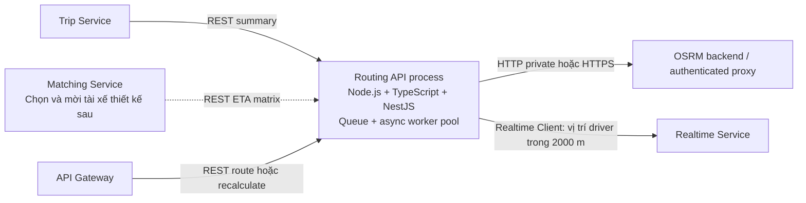
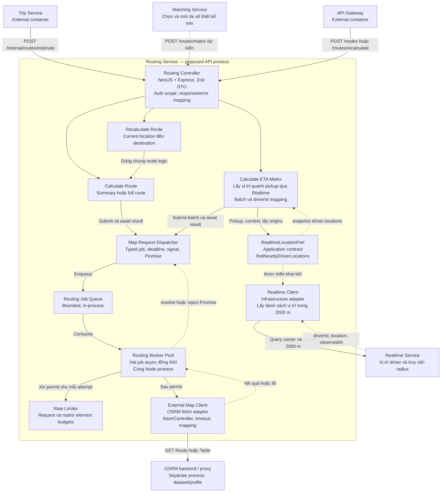

# Kiến trúc Routing Service và component C3

Ngày lập: 06/10/2026. Tất cả class/module/port bên dưới là **thiết kế dự kiến**, chưa có mã nguồn runtime. Stack đã chọn: **Node.js 24 + TypeScript 5.9 + NestJS 11 + Express**, Zod 4, HTTP client `fetch` và `AbortController`. Compiler strict, npm/ESLint/tsx và `node:test` được tổ chức tương tự Trip; domain/application độc lập với NestJS.

## 1. Ranh giới runtime

Phase 1 dùng một API process/một replica: controller, application, bounded queue, async worker pool, limiter, OSRM client và Realtime Client cùng process. Realtime Client thuộc Routing, chỉ lấy danh sách vị trí tài xế trong bán kính 2 km. Pool giới hạn số map job I/O async đang xử lý, mặc định hai job; không dùng worker threads hoặc process riêng. Không có DB riêng, outbox, broker, API job polling hay worker container độc lập trong phase này. Trip vẫn sở hữu outbox gửi command/event nghiệp vụ của Trip.



## 2. C3 theo sơ đồ được cung cấp



Application trả kết quả của dispatcher về controller trong cùng HTTP request. Đây là chiều trả kết quả cần bổ sung cho hình gốc: queue không khiến API trả 202 rồi bỏ request đang chờ. Endpoint Trip luôn trả 200 summary hoặc lỗi; chuyển thành durable job/202 trong phase sau sẽ cần một contract khác.

Realtime Client là bổ sung theo yêu cầu người dùng sau C3 gốc. Calculate ETA Matrix gọi port để lấy vị trí driver quanh pickup trong radius 2000 m, sau đó gửi origins/pickup vào OSRM matrix pipeline. Matching gọi API bằng điểm đón/profile xe, nhận ETA theo driverId; việc chọn/mời tài xế bên trong Matching thiết kế sau. [Realtime Client](realtime-client.md) mô tả dependency này.

## 3. Trách nhiệm và nghiệm thu từng component

| Component | Input / output | Trách nhiệm sở hữu | Tiêu chí nghiệm thu |
| --- | --- | --- | --- |
| Routing Controller | HTTP DTO + verified caller → envelope | Xác thực scope, input/output schema, correlation, error mapping | Caller sai không gọi provider; endpoint Trip trả đúng strict data |
| Calculate Route | Origin/destination/vehicle → RouteResult | Validate tọa độ, chọn profile, chọn summary/full view | Đúng đơn vị; summary không có geometry; không fake route khi real lỗi |
| Calculate ETA Matrix | Pickup/vehicle → driver location + ETA entries | Gọi Realtime Client radius 2000 m, batch theo capability, map driverId, chuẩn hóa partial NO_ROUTE | Empty snapshot không gọi OSRM; dependency lỗi không giả empty; giữ metadata driver; cùng deadline từ lookup đến matrix |
| Recalculate Route | CurrentLocation/destination/vehicle → RouteResult | Dùng lại route logic với origin mới | Không truy cập Trip DB, không đổi giá hay trạng thái |
| Map Request Dispatcher | Typed route/matrix request → Promise kết quả | Tạo job ID/Promise/deadline/signal, admission, propagate result/error/cancel | Không await vô hạn; queue-full nhanh; result không lẫn giữa caller; Promise settle một lần |
| Routing Job Queue | RoutingJob → worker job | Giới hạn số job, tuổi job, backpressure | Đầy trả ROUTING_BUSY; job hết hạn không gọi provider; mọi job được hoàn tất hoặc từ chối tường minh |
| Routing Worker Pool | Job → resolve/reject Promise | Bounded async concurrency, cleanup trong finally, deadline, retry orchestration | Worker tiếp tục sau một job lỗi; giải phóng slot mọi nhánh; không gửi job canceled |
| Rate Limiter | Request attempt/element count → permit/error | Rate và burst cap, per-process shared budget, matrix element budget | Mọi retry cũng xin permit; chờ hữu hạn; đủ capacity cho batch hoặc từ chối |
| External Map Client | Provider-independent request → validated result | OSRM Route/Table, transport/auth theo endpoint, capability, mapping, sanitized errors | Đúng provider schema; không log key; không auto fallback mode; giới hạn response |
| Realtime Client | Center + radius 2000 m + context → DriverLocation[] | Gọi Realtime qua port, validate/chuẩn hóa driverId/location/observedAt; giữ metadata nguồn | Đúng bán kính; empty khác lỗi; token riêng; timeout/cancel; không xếp hạng/gán hoặc tự tính ETA |
| Config/composition root | Env/secret/profile file → dependencies | Validate cấu hình, chọn mock/OSRM/Realtime adapters độc lập, start/stop lifecycle | Real thiếu cấu hình lỗi startup; header auth thiếu key lỗi; OSRM auth none không cần key; production cấm mock |

## 4. Ports và cấu trúc dự kiến

```text
service/routing-service/
  .env.example                 # mẫu đã tạo
  .env                         # local, Git ignored
  config/vehicle-profiles.example.json
  config/vehicle-profiles.json  # local, Git ignored
  docs/                        # tài liệu đã tạo
  package.json                 # phần dưới chưa triển khai; npm scripts/dependencies
  package-lock.json
  tsconfig.json                # strict, ES2023/Node16, decorators như Trip
  tsconfig.test.json
  eslint.config.mjs
  src/
    main.ts                    # bootstrap NestJS API
    api/                       # NestJS controllers/guards, Zod DTO, errors, OpenAPI
    domain/                    # Location, RouteResult, MatrixResult, capability
    application/
      use-cases/               # calculate-route, eta-matrix, recalculate
      ports/                   # MapDispatcher, MapProvider, Clock, RealtimeLocationPort
    infrastructure/
      dispatcher.ts
      queue.ts
      worker-pool.ts
      rate-limiter.ts
      providers/               # OSRM adapter + mock
      clients/                 # realtime-client.ts + mock, wire mapping của Realtime
    bootstrap/                 # settings, composition, singleton runtime/lifecycle
  test/                        # unit, contract, integration, concurrency, lifecycle
  scripts/                     # compile/run test helpers như Trip
```

Các port dự kiến: `MapDispatcher.execute(job, { deadline, signal })` được application dùng và trả `Promise` kết quả typed; `MapProvider.route()/matrix()` cho worker nhận `AbortSignal`; provider capabilities mô tả modes/geometry/matrix/max batch. Job giữ operation, requestId, payload đã validate, deadline monotonic và cơ chế resolve/reject Promise. `Clock` được inject để test thời gian/limiter. Provider key được giữ trong adapter/config riêng, không serialize vào job hoặc response.

`RealtimeLocationPort.findNearbyDriverLocations(center, context): Promise<DriverLocation[]>` dùng context requestId/deadline/signal; adapter lấy bán kính 2000 m từ settings. Realtime Service sở hữu query radius; Routing giữ schema đã chuẩn hóa. Client này dùng timeout/credential riêng và không đi qua OSRM map queue/limiter. Không làm route/estimate/recalculate phụ thuộc vào Realtime.

Calculate ETA Matrix dùng pickup làm center rồi giữ mapping snapshot driverId/location/observedAt → origin index qua mọi batch. Đầu vào API không có candidates; không giả định vị trí là bằng chứng tài xế rảnh/đúng loại xe. Snapshot vượt MATRIX_MAX_CANDIDATES bị từ chối theo capacity trước khi dispatch map job, không bị cắt âm thầm.

NestJS controller/guard/filter nằm ở API; các port thuộc application và nhận implementation qua composition root. Domain/application dùng TypeScript thuần. Zod 4 validate request, settings và provider response ở boundary. Compile strict với ES2023, Node16 module/moduleResolution, decorator metadata và noUncheckedIndexedAccess tương tự [Trip tsconfig](../../trip-service/tsconfig.json).

## 5. Lifecycle, deadline và retry

- Queue/pool/limiter, OSRM adapter và Realtime Client là singleton providers. Runtime provider khởi tạo ở `onApplicationBootstrap`; bật `app.enableShutdownHooks()` cho signal shutdown. `onModuleDestroy` đóng admission/readiness, `beforeApplicationShutdown` drain/cancel hữu hạn, gồm thu dọn Realtime requests đang chạy. [NestJS lifecycle](https://docs.nestjs.com/fundamentals/lifecycle-events).
- Bounded queue trong RAM có admission timeout và job-age limit; dispatcher trả Promise, pool chỉ bắt đầu tối đa `WORKER_POOL_SIZE` job đồng thời. `finally` thu dọn timer/listener/response stream và giải phóng slot; catch job error để worker tiếp tục. Không để unhandled rejection hoặc Promise treo.
- Deadline end-to-end đề xuất 4 giây, nhỏ hơn Trip `HTTP_TIMEOUT_MS=5000` hiện tại. Queue, limiter, provider HTTP/read body, retry/backoff, batch aggregation và serialize cùng dùng một deadline; mỗi attempt chỉ dùng thời gian còn lại.
- Timeout enqueue/admission khác tuổi tối đa khi nằm queue; cả hai được kiểm soát. Job bị caller cancel/hết deadline trước dispatch được loại và reject; Promise chỉ settle một lần. Dùng `AbortController` kết hợp cancellation của caller, deadline job và timeout attempt; signal được truyền vào fetch/read body và các bước chờ. HTTP đã gửi trước disconnect vẫn có thể được OSRM xử lý; cancel không chứng minh provider chưa xử lý.
- Worker xin rate permit ở từng attempt. Retry tối đa 2 attempts tổng, với jitter/backoff và Retry-After chỉ khi còn budget; network/429/5xx tạm thời được retry. Input lỗi, mode sai, auth/key lỗi, NO_ROUTE và schema sai không retry.
- Realtime lookup và matrix batching nằm trong cùng deadline request, không tạo budget mới sau lookup. Empty snapshot trả kết quả rỗng; lookup lỗi dừng trước OSRM. Không bắt đầu batch/attempt nếu không đủ budget; số worker không vượt concurrency cấu hình. Lỗi một batch hủy/thu dọn các phần việc còn lại rồi trả lỗi theo contract v1.
- Shutdown đóng admission, readiness=false, hoàn tất job còn đủ deadline trong grace, reject job queued/cancel request đang chạy khi hết grace, dừng pool và thu dọn response streams/timers/listeners. Lifecycle tests gọi `app.close()`; signal shutdown được kiểm tra trong Linux container. Queue in-memory mất khi process chết; caller retry tính toán. Không hứa durable delivery/exactly once.

## 6. Quota, scaling và dữ liệu

Limiter phase 1 là per-process, dùng chung cho mọi caller trong process; triển khai **một process, một replica**. Chạy nhiều Node processes/replicas sẽ nhân quota outbound. Phase sau cần global quota coordination hoặc phân bổ quota rõ ràng; chỉ thêm Redis limiter không khiến job queue trở thành durable.

Request budget bảo vệ request/sec; matrix budget bảo vệ element count riêng. Defaults trong `.env.example` bảo vệ tải endpoint OSRM riêng, không cấp quyền gọi public demo. Batching còn chịu số tọa độ N+1, độ dài URL và giới hạn server; xem [OSRM wire contract](api.md#7-osrm-adapter-contract-dự-kiến). Table distance capability cần kiểm thử ở version/algorithm cụ thể.

OSRM là dependency riêng với dataset/profile đã build; URL tùy profile có thể khác server. V1 không tự cung cấp traffic realtime, geocoding hay map tiles. Không chọn public demo mặc định; xem [deploy](deploy.md) cho dữ liệu, sizing và vận hành.

Không persist/cache route payload mặc định; `requestId` không phải cache key. Route geometry, attribution và quyền lưu dữ liệu cần review theo provider trước khi thêm cache. Log chỉ operation/requestId/jobId, latency, queue depth, attempts, error category, quota usage; không log key, Authorization, raw provider URL/query, tọa độ đầy đủ hay toàn bộ steps.

## 7. Tương thích Trip

Trip gọi `POST /internal/routes/estimate` với service token và UUID request ID. Adapter Trip dùng strict schema cho `data`: chỉ `distanceMeters` và `durationSeconds`, cả hai integer không âm/INT32. Vì vậy full route được tách ở `/routes`; không thêm polyline vào response của estimate.

Routing error không thay đổi Trip status hoặc giá. Trip hiện gom lỗi Routing thành `DEPENDENCY_UNAVAILABLE` và không phát hành quote khi dependency lỗi; không sửa policy đó trong thiết kế Routing này.
