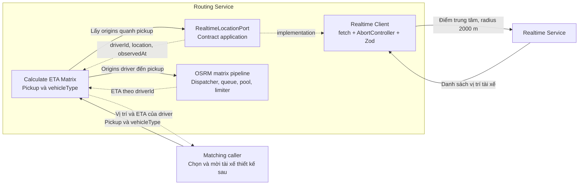

# Realtime Client trong Routing Service

Ngày cập nhật: 06/10/2026. **Port/mock, validation và ETA orchestration đã triển khai; HTTP adapter thật chờ contract.** [Client](../src/infrastructure/realtime/client.ts) nằm trong Routing, lấy vị trí driver trong bán kính **2 km** quanh pickup để Calculate ETA Matrix tính ETA trả Matching. Nghiệp vụ chọn/mời tài xế bên trong Matching được thiết kế sau.

## 1. Trách nhiệm

Realtime Service sở hữu dữ liệu vị trí và truy vấn không gian. `RealtimeClient` là adapter infrastructure của Routing, gọi service này, validate và chuẩn hóa response; application nhận adapter qua `RealtimeLocationPort`.



Client lấy/chuẩn hóa vị trí; Calculate ETA Matrix điều phối lookup rồi tính ETA. R03 nhận pickup/vehicleType, gọi port này và dùng snapshot làm origins; Matching không truyền candidates. Routing trả kết quả theo driverId và metadata nguồn; chọn/mời tài xế thuộc Matching. Giữ endpoint matrix hiện có, không thêm nearby endpoint.

## 2. Contract application đề xuất

`RealtimeLocationPort.findNearbyDriverLocations(center, context): Promise<DriverLocation[]>`.

- `center`: Location `{lat, lng}` đã validate; là tâm tìm kiếm do application cung cấp.
- Bán kính: lấy settings `NEARBY_DRIVER_RADIUS_METERS=2000`, v1 cố định 2 km. Đây là bán kính địa lý quanh tâm, không phải giới hạn khoảng cách đường đi của OSRM; cách truy vấn phải được xác nhận với Realtime.
- `context`: requestId, deadline monotonic và AbortSignal. Client sử dụng thời gian còn lại; timeout riêng không vượt deadline của caller.
- Output chuẩn hóa: một entry cho mỗi driverId, gồm tọa độ và `observedAt` là thời điểm đo/cập nhật vị trí từ nguồn; không thay bằng thời gian Routing nhận response.

```json
[
  {
    "driverId": "driver-a",
    "location": {"lat": 10.7700, "lng": 106.6900},
    "observedAt": "2026-10-06T02:00:00.000Z"
  }
]
```

ID là opaque string không rỗng; lat/lng hữu hạn và trong WGS84 bounds; observedAt là timestamp UTC hợp lệ. Danh sách rỗng `[]` là kết quả thành công. ID trùng hoặc entry thiếu/sai schema khiến response lỗi; không tự chọn một vị trí bất kỳ. Bảo toàn thứ tự nguồn và không âm thầm cắt danh sách theo `MATRIX_MAX_CANDIDATES`, vì đây là contract lấy vị trí riêng.

Client giữ thời điểm cập nhật; ETA Matrix trả observedAt/location cùng ETA để Matching đánh giá độ mới. TTL vị trí và quy tắc lọc stale chưa được chốt; không tự thêm ngưỡng hoặc coi có tọa độ là đủ điều kiện nhận chuyến. Snapshot vượt MATRIX_MAX_CANDIDATES bị application từ chối theo capacity trước khi gọi OSRM; client không tự cắt danh sách.

## 3. Wire contract và lỗi

Repo hiện chưa có Realtime implementation/OpenAPI. Method, path, envelope, auth header và khả năng truy vấn radius phải được đối chiếu service đó trước khi triển khai real adapter. Schema trên là contract application đề xuất, không phải HTTP API đã tồn tại ở Realtime. Client dùng URL cấu hình tin cậy, không nhận URL/token từ payload; không theo redirect.

Các lỗi nội bộ đề xuất: `REALTIME_UNAVAILABLE` cho network/service lỗi; `REALTIME_DEADLINE_EXCEEDED` cho timeout/deadline; `INVALID_REALTIME_RESPONSE` cho malformed/oversize/schema; `REALTIME_CONFIGURATION_ERROR` cho URL/credential hoặc auth sai. Không chuyển lỗi thành danh sách rỗng. V1 không retry tự động ở client này; caller quyết định retry sau, tránh phát sinh vòng chờ không giới hạn.

OSRM limiter/queue dành cho map jobs; client Realtime là dependency riêng, không tiêu thụ map quota. Readiness không gọi Realtime; estimate/full route/recalculate giữ độc lập với dependency vị trí. Không log token/raw location list; output không chứa profile tài khoản hoặc dữ liệu reservation.

ETA Matrix tạo một deadline end-to-end dùng chung cho lookup, queue/rate wait, OSRM attempts/batches và aggregation. Realtime lỗi/timeout dừng trước dispatch OSRM. Snapshot rỗng trả HTTP 200 entries rỗng; client lỗi phải được chuyển thành lỗi API theo [API](api.md), không thành empty list.

## 4. Cấu hình và kiểm thử

Các biến mẫu nằm trong `.env.example`: `REALTIME_INTEGRATION_MODE`, `REALTIME_BASE_URL`, `REALTIME_TOKEN`/`_FILE`, `REALTIME_TIMEOUT_MS=1000`, `REALTIME_MAX_RESPONSE_BYTES=1048576`, `NEARBY_DRIVER_RADIUS_METERS=2000`. Mode mock độc lập OSRM; real cần wire contract/endpoint/credential hợp lệ. Không dùng map key hoặc token inbound Routing để gọi Realtime.

Feature **F11** trong [kế hoạch](ke-hoach-phat-trien.md): interface/domain DTO + mock + real fetch adapter sau khi wire contract được xác nhận. Unit/contract tests dùng fake Realtime server: đúng tâm/radius 2000, ID/tọa độ/thời điểm preserved, danh sách rỗng, invalid/duplicate entries, HTTP lỗi/auth sai, malformed/oversize body, timeout/cancel và redaction. Không cần chạy Matching để nghiệm thu component này.

Feature F08 phụ thuộc F11, kiểm thử phối hợp R03 → Realtime → OSRM bằng fake upstreams: Matching chỉ gửi pickup/profile; origins lấy từ snapshot, kết quả map đúng driverId; empty/error không gọi OSRM; danh sách vượt cap không bị cắt; deadline không reset. Matching implementation không cần tồn tại để test Routing API.
