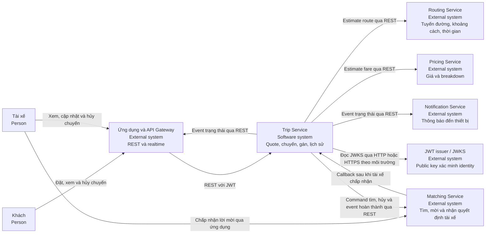
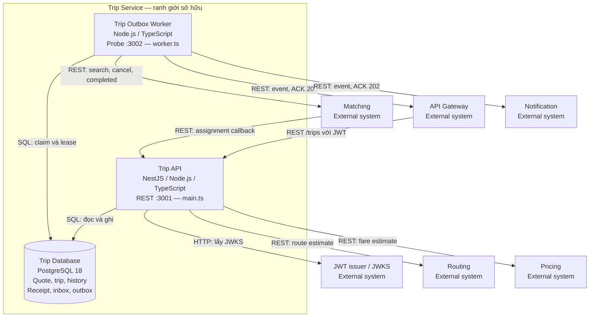
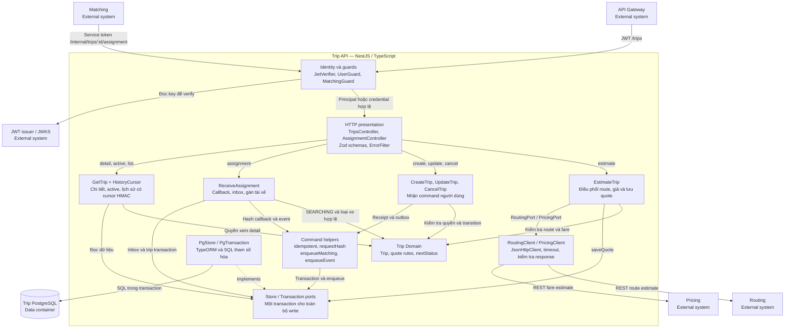
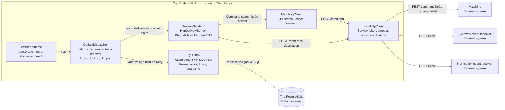
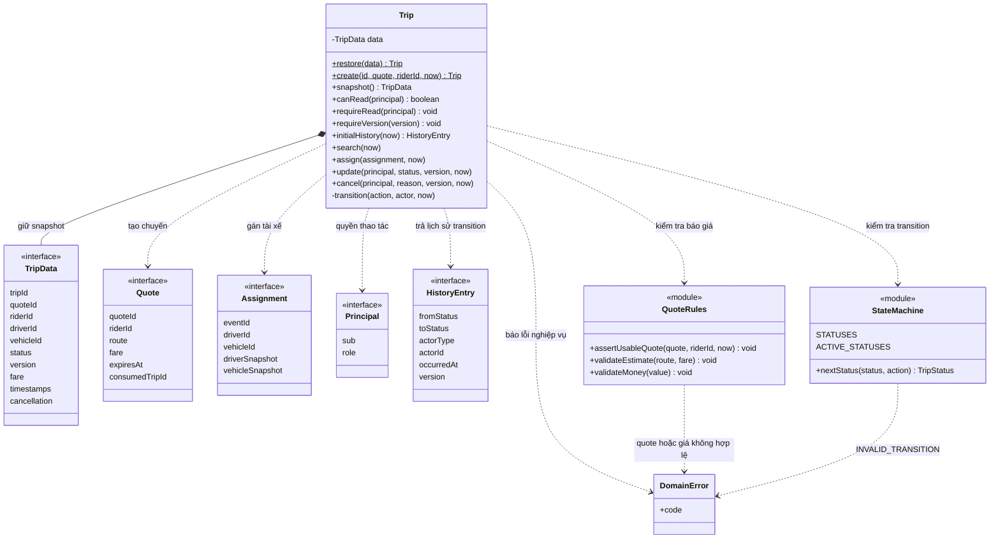
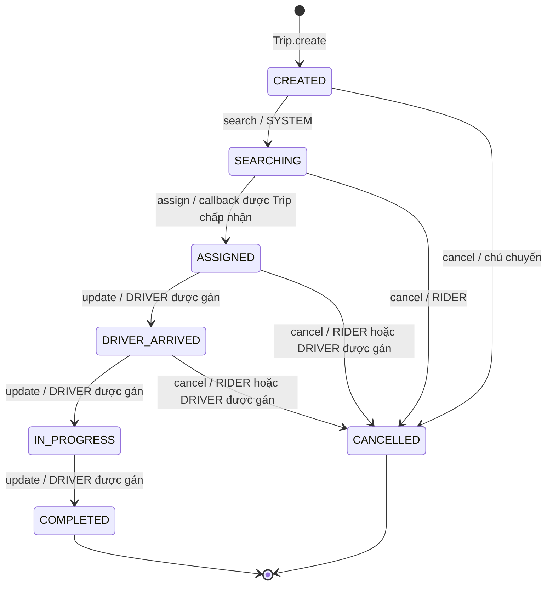
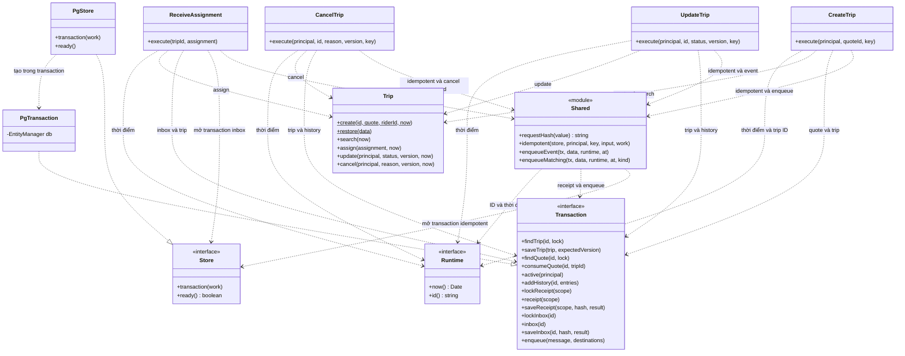
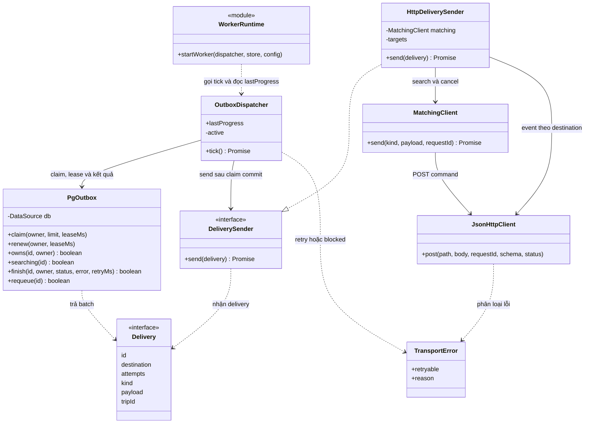
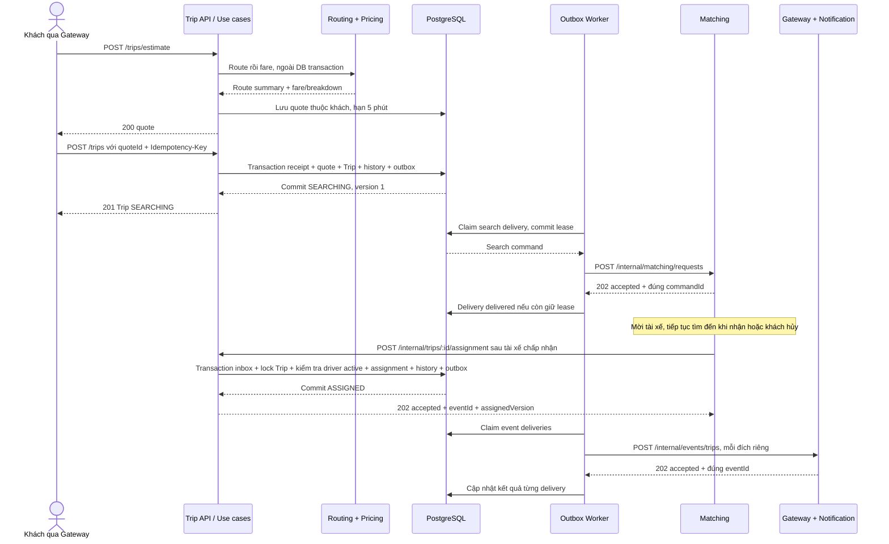

# C4 — Trip Service v1

Ngày đối chiếu: 06/10/2026. Sơ đồ mô tả mã nguồn hiện có trong `service/trip-service`, không phải kiến trúc mục tiêu chưa triển khai.

Trip sở hữu quote, vòng đời chuyến, quyết định gán tài xế, quyền thao tác và lịch sử. API ghi thay đổi cùng outbox trong một transaction; worker gửi command/event sau commit. Local đã gọi API Routing và Price riêng qua HTTP; Routing dùng map provider mock và Price dùng policy mẫu. Matching, Gateway, Notification và issuer JWT local còn dùng mock. Xem [báo cáo tích hợp](tich-hop-routing-price.md).

## Cách đọc

| Mức | Câu hỏi được trả lời | Sơ đồ trong tài liệu |
| --- | --- | --- |
| C1 — Context | Trip phục vụ ai, trao đổi với hệ thống nào? | Ranh giới Trip và các bên ngoài |
| C2 — Container | Trip gồm những ứng dụng và kho dữ liệu nào? | API, worker, PostgreSQL |
| C3 — Component | Bên trong mỗi ứng dụng có những khối trách nhiệm nào? | Component API và component worker, tách riêng |
| C4 — Code | Component được hiện thực bằng class/interface/hàm nào? | Domain, application ghi chuyến, outbox delivery |

Theo [C4 Code diagram](https://c4model.com/diagrams/code), mức C4 đi vào code của một component. Ba sơ đồ C4 dưới đây tập trung vào các phần cần review kỹ; các kiểu và dependency hỗ trợ cũng được đưa vào để đọc được quan hệ. C3 có phạm vi một container, còn C2 thể hiện ứng dụng/kho dữ liệu theo [định nghĩa C4](https://c4model.com/diagrams/container); container trong C4 không đồng nghĩa với Docker container.

Sơ đồ dùng Mermaid để chỉnh sửa cùng mã nguồn và xem trong GitHub hoặc trình preview hỗ trợ Mermaid. Mũi tên liền trong flowchart là lời gọi/trao đổi dữ liệu; mũi tên nét đứt là dependency hoặc triển khai interface, không phải một kênh mạng khác. Trong class diagram, `..|>` là implements, `..>` là sử dụng, `*--` là dữ liệu được giữ bên trong. Các ô `<<module>>` biểu diễn file chứa hàm TypeScript, không phải class có thật.

### Bản SVG để xem hoặc đưa vào báo cáo

SVG có thể mở bằng trình duyệt và phóng to. Mermaid trong tài liệu này là nguồn chỉnh sửa; [hướng dẫn xuất lại](diagrams/README.md) giữ tên file ổn định.

| Sơ đồ | Bản vẽ |
| --- | --- |
| C1 — Context | [01-context.svg](diagrams/01-context.svg) |
| C2 — Containers | [02-containers.svg](diagrams/02-containers.svg) |
| C3 — API components | [03-api-components.svg](diagrams/03-api-components.svg) |
| C3 — Worker components | [04-worker-components.svg](diagrams/04-worker-components.svg) |
| C4 — Trip Domain | [05-domain-code.svg](diagrams/05-domain-code.svg) |
| Vòng đời chuyến | [06-trip-lifecycle.svg](diagrams/06-trip-lifecycle.svg) |
| C4 — Application và transaction | [07-application-code.svg](diagrams/07-application-code.svg) |
| C4 — Outbox Delivery | [08-outbox-code.svg](diagrams/08-outbox-code.svg) |
| Luồng đặt và nhận chuyến | [09-booking-flow.svg](diagrams/09-booking-flow.svg) |

## 1. C1 — Trip trong hệ thống đặt xe

Phạm vi: Trip Service là hệ thống được quan sát; các dịch vụ khác nằm ngoài ranh giới sở hữu của Trip. Khách và tài xế thao tác qua ứng dụng/Gateway; việc tài xế nhận lời mời thuộc Matching.

User/Customer và Driver Service vẫn sở hữu hồ sơ và phương tiện. Trip lưu ID tham chiếu cùng snapshot được nhận qua contract; code hiện tại không gọi trực tiếp API/database của hai service đó. Vì vậy không thêm quan hệ runtime trực tiếp từ Trip đến User/Driver trong sơ đồ.

## 2. C2 — Các container của Trip

Phạm vi: phân rã Trip thành hai ứng dụng chạy lâu dài và một kho dữ liệu. API và worker phát hành từ cùng image nhưng là hai tiến trình độc lập.

- API và worker phối hợp qua outbox trong PostgreSQL; không gọi nhau trực tiếp và không dùng Redis/message broker trong v1.
- `migrate.ts` là job chạy đến khi hoàn thành, dùng role migration và advisory lock; không phải một API nghiệp vụ. `requeue.ts` là CLI vận hành để đưa delivery `blocked` về `pending`.
- `mock.ts` là ứng dụng phụ cho local/test: issuer thử, Matching và event receivers. Các route Routing/Pricing cũ chỉ phục vụ tests riêng; Compose estimate gọi service Routing/Price riêng. Mock không thuộc triển khai production.
- Production dùng `compose.deploy.yml`: DB trong mạng `trip-db` nội bộ, API/worker kết nối thêm mạng backend. Port 3002 chỉ phục vụ probe, không nhận request người dùng. Local có `compose.local.yml` riêng; xem [Deploy](deploy.md).

## 3. C3 — Component trong Trip API

Phạm vi: chỉ container Trip API. Các component được gom theo trách nhiệm; tên class/hàm cụ thể nằm ở C4 và bảng ánh xạ cuối tài liệu.

`TripContext` trong composition root khởi tạo use case, store, runtime, HTTP clients và verifier; Nest inject giá trị này qua token `TRIP_CONTEXT`. `HealthController` dùng `Store.ready()` để probe DB/schema; Swagger/OpenAPI sinh từ controller khi cấu hình bật. Các thành phần bootstrap/probe không quyết định nghiệp vụ nên được mô tả ở đây thay vì thêm cạnh vào toàn bộ sơ đồ.

## 4. C3 — Component trong Outbox Worker

Phạm vi: chỉ container worker. API là bên ghi outbox trước đó; worker không chạy lại use case để tạo chuyến hoặc tự hủy vì không có tài xế.

Delivery được gửi ít nhất một lần: retry giữ command/event ID, bên nhận cần chống lặp. Gateway và Notification có delivery độc lập; `trip.completed` có thêm delivery đến Matching để giải phóng reservation. ACK 202 phải chứa đúng ID. Lease hết hạn cho phép worker khác claim lại; ghi kết quả phải còn đúng lease owner.

## 5. C4 — Code của Trip Domain

Phạm vi: `src/domain`. Sơ đồ lược bớt field/phương thức không cần để giải thích nghiệp vụ; các tên hiển thị đều có trong code. `Trip` giữ snapshot riêng và trả một `Trip` mới khi transition, không sửa đối tượng trước đó.

Quy tắc ở domain:

- Quote thuộc khách, còn hạn 5 phút và chưa dùng; kiểm tra sau khi application đã lấy lock quote.
- Chỉ khách sở hữu hoặc tài xế được gán được xem chuyến. Đối tượng ngoài quyền đọc nhận `RESOURCE_NOT_FOUND`.
- Chỉ tài xế được gán cập nhật `DRIVER_ARRIVED`, `IN_PROGRESS`, `COMPLETED`; cập nhật/hủy phải đúng version.
- Khách hoặc tài xế được gán chỉ hủy trước `IN_PROGRESS`; không phí hủy, không tìm lại khi tài xế hủy.
- `COMPLETED` chốt `finalAmount = estimatedAmount`. Hai trạng thái kết thúc không mở lại.

Giới hạn **một chuyến active cho mỗi khách/tài xế** liên quan nhiều Trip: application kiểm tra `Transaction.active()` và PostgreSQL bảo vệ bằng unique partial indexes. `Trip` tự nó không truy vấn các chuyến khác.

`CREATED` là trạng thái khởi tạo của domain: Create ghi snapshot `SEARCHING` version 1 cùng hai history entry version 0/1 trong một transaction, không INSERT một bản ghi `CREATED` riêng. Không có nhánh timeout tự hủy khỏi `SEARCHING`.

## 6. C4 — Code của application ghi chuyến và transaction

Phạm vi chính: `application/use-cases/create.ts`, `update.ts`, `cancel.ts`, `assignment.ts`, `shared.ts`. Domain và adapter persistence là dependency hỗ trợ. `shared.ts` chứa các hàm dùng chung; receipt và inbox là hai cơ chế riêng.

### Trình tự ghi và bảo vệ cạnh tranh

| Use case | Trình tự trong cùng transaction | Kết quả được phát sau commit |
| --- | --- | --- |
| Create | Lock receipt → kiểm tra replay/hash → lock quote → domain create/search → kiểm tra khách active → save Trip/consume quote/history → outbox → receipt | Matching search command; `trip.searching` đến Gateway/Notification |
| Assignment | Lock inbox → kiểm tra replay/hash → lock Trip → domain assign → kiểm tra tài xế active → save Trip theo version/history → outbox → inbox ACK | `trip.assigned` đến Gateway/Notification |
| Update | Lock receipt → lock Trip → quyền/version/transition → save/history → outbox → receipt | Event tương ứng; `trip.completed` gửi thêm đến Matching |
| Cancel | Lock receipt → lock Trip → quyền/version/transition → save/history → outbox cancel + event → receipt | Matching cancel command và `trip.cancelled` đến Gateway/Notification |

`idempotent()` định danh receipt bằng `role:sub:key`; hash bao gồm operation và nội dung command đã chuẩn hóa. Cùng key/hash trả lại kết quả cũ, không chạy lại business write; key cũ với hash khác bị từ chối. Assignment dùng `eventId` và hash callback trong inbox; callback trùng đã commit trả lại ACK cũ, không mở lại chuyến.

`PgStore.transaction()` dùng `READ COMMITTED`, `lock_timeout` 5 giây và retry có giới hạn cho deadlock/serialization. `PgTransaction` dùng cùng `EntityManager` cho mọi write, `FOR UPDATE` khi được yêu cầu, advisory transaction lock cho receipt/inbox và UPDATE theo expected version. Unique indexes bảo vệ rider active, driver active và quote dùng một lần. Timeout lock/HTTP là lỗi kỹ thuật; không phải deadline tìm tài xế.

`EstimateTrip` gọi `RoutingPort.estimate()` rồi `PricingPort.estimate()` ngoài DB transaction, kiểm tra dữ liệu, sau đó lưu quote. `GetTrip` chỉ đọc; `HistoryCursor` ký HMAC gắn với actor/filter để phân trang lịch sử kết thúc. Hai luồng này xem thêm [API](api.md).

## 7. C4 — Code của Outbox Delivery

Phạm vi: `infrastructure/outbox`. Client HTTP và worker runtime là dependency hỗ trợ.

Chi tiết cần validate:

- `OutboxDispatcher` hiện phụ thuộc trực tiếp `PgOutbox`; không có interface `OutboxRepository` riêng trong code. `DeliverySender` là interface có thật. Sơ đồ không giả định toàn bộ infrastructure đã được tách qua port.
- `claim()` dùng `FOR UPDATE SKIP LOCKED`, tăng attempts, đặt lease và commit trước khi HTTP được gửi. Lease được renew trong lúc xử lý batch; `owns()`/`finish()` kiểm tra quyền lease.
- Search delivery cho Trip không còn `SEARCHING` được `skipped`. Cancel command và terminal marker bên Matching vẫn cần để xử lý race giữa kiểm tra trạng thái và gửi search.
- Lỗi retryable quay về `pending` với exponential backoff có jitter; lỗi contract/credential hoặc ACK sai chuyển `blocked`. CLI `requeue.ts` xử lý sau khi đã sửa nguyên nhân, không tự sửa trạng thái Trip.
- Payload chỉ có dữ liệu theo contract; `JsonHttpClient` kiểm tra status, schema, giới hạn response, timeout và không theo redirect. Request ID mới cho mỗi lần gửi; command/event ID giữ nguyên từ outbox.

## 8. Luồng động — từ quote đến tài xế được gán

Đây là sơ đồ bổ trợ mô tả thứ tự chạy; không thay cho C4 code diagram.

Nếu khách hủy thắng trước callback, assignment mới bị từ chối vì Trip không còn `SEARCHING`. Nếu assignment thắng trước, cancel dùng version cũ bị conflict; khách đọc lại và có thể hủy với version mới trước `IN_PROGRESS`. Cùng `eventId` của assignment đã thành công vẫn được replay ACK sau khi hủy; ACK đó là kết quả cũ, không phải gán lại.

## 9. Dữ liệu và nguồn đối chiếu

| Nhóm dữ liệu | Bảng thực tế | Bên đọc/ghi |
| --- | --- | --- |
| Báo giá | `trip_quotes` | Estimate lưu; Create lock/consume |
| Chuyến và lịch sử | `trips`, `trip_status_history` | Application qua `PgTransaction` |
| Request lặp | `request_receipts` | Create/Update/Cancel qua `idempotent()` |
| Callback lặp | `inbox_messages` | ReceiveAssignment |
| Command/event và trạng thái gửi | `outbox`, `outbox_deliveries` | API enqueue; worker claim/send/finish |

ERD ban đầu là nguồn thiết kế; bảng quote, receipt, inbox và delivery đã được bổ sung để thực hiện chống lặp và giao nhận bất đồng bộ. Snapshot JSONB đi cùng các cột/index bảo vệ nghiệp vụ; migration integrity kiểm tra sự khớp giữa hai phần. Không có foreign key xuyên database service.

| Component / code element | File nguồn |
| --- | --- |
| Entry points, composition root | [main.ts](../src/main.ts), [worker.ts](../src/worker.ts), [TripContext](../src/bootstrap/context.ts) |
| Controller, guards, DTO và lỗi HTTP | [controllers.ts](../src/api/controllers.ts), [auth.ts](../src/api/auth.ts), [schemas.ts](../src/api/schemas.ts), [http.ts](../src/api/http.ts) |
| Trip, state machine, quote rules và models | [trip.ts](../src/domain/trip.ts), [state-machine.ts](../src/domain/state-machine.ts), [quote.ts](../src/domain/quote.ts), [models.ts](../src/domain/models.ts) |
| Estimate và Get | [estimate.ts](../src/application/use-cases/estimate.ts), [get.ts](../src/application/use-cases/get.ts) |
| Command use cases | [create.ts](../src/application/use-cases/create.ts), [update.ts](../src/application/use-cases/update.ts), [cancel.ts](../src/application/use-cases/cancel.ts), [assignment.ts](../src/application/use-cases/assignment.ts) |
| Idempotency và enqueue helpers | [shared.ts](../src/application/use-cases/shared.ts) |
| Store/Transaction và external ports | [ports/store.ts](../src/application/ports/store.ts), [ports/clients.ts](../src/application/ports/clients.ts) |
| PgStore và PgTransaction | [persistence/store.ts](../src/infrastructure/persistence/store.ts) |
| Dispatcher, delivery sender, PgOutbox | [dispatcher.ts](../src/infrastructure/outbox/dispatcher.ts), [repository.ts](../src/infrastructure/outbox/repository.ts) |
| HTTP clients | [http.ts](../src/infrastructure/clients/http.ts), [routing.ts](../src/infrastructure/clients/routing.ts), [pricing.ts](../src/infrastructure/clients/pricing.ts), [matching.ts](../src/infrastructure/clients/matching.ts) |
| Schema và integrity | [initial migration](../src/infrastructure/persistence/migrations/1791158400000-initial.ts), [integrity migration](../src/infrastructure/persistence/migrations/1791158400001-integrity.ts) |
| Vận hành, local mock | [migrate.ts](../src/migrate.ts), [requeue.ts](../src/requeue.ts), [mock.ts](../src/mock.ts), [worker-runtime.ts](../src/bootstrap/worker-runtime.ts) |

## 10. Điểm review và giới hạn hiện tại

- [ ] Ranh giới API/worker/DB và chiều giao tiếp khớp deployment dự kiến của cả hệ thống.
- [ ] Domain giữ đúng giá đã chốt, chính sách hủy và trạng thái active đã thống nhất.
- [ ] Trip là bên quyết định assignment; tài xế được mời chưa có quyền của tài xế được gán.
- [ ] Matching thật có durable ACK, chống lặp, tiếp tục tìm và terminal marker phù hợp với cancel/completed đến muộn.
- [ ] Gateway/Notification thật nhận event với đúng contract và delivery độc lập.
- [ ] Issuer/JWKS, vehicle codes, credential và network production được thống nhất trước tích hợp.
- [ ] Khi sửa class, transaction hoặc contract, cập nhật C4 tương ứng cùng thay đổi code.

Các kiểm thử và kết quả chạy trước đây nằm trong [Báo cáo triển khai](bao-cao-trien-khai.md); tài liệu này không khẳng định bộ test đã được chạy lại. Chính sách: [Nghiệp vụ](nghiep-vu.md). Thiết kế chi tiết: [Kiến trúc](kien-truc.md). Contract: [API](api.md), [Routes](routes.md). Vận hành: [Deploy](deploy.md).
