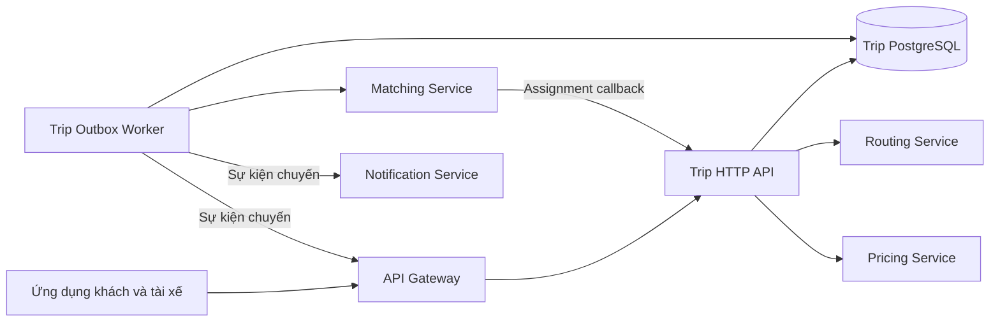
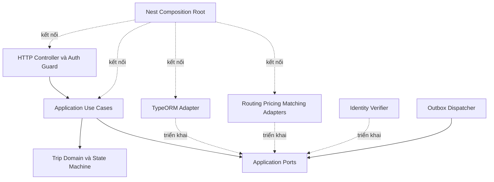
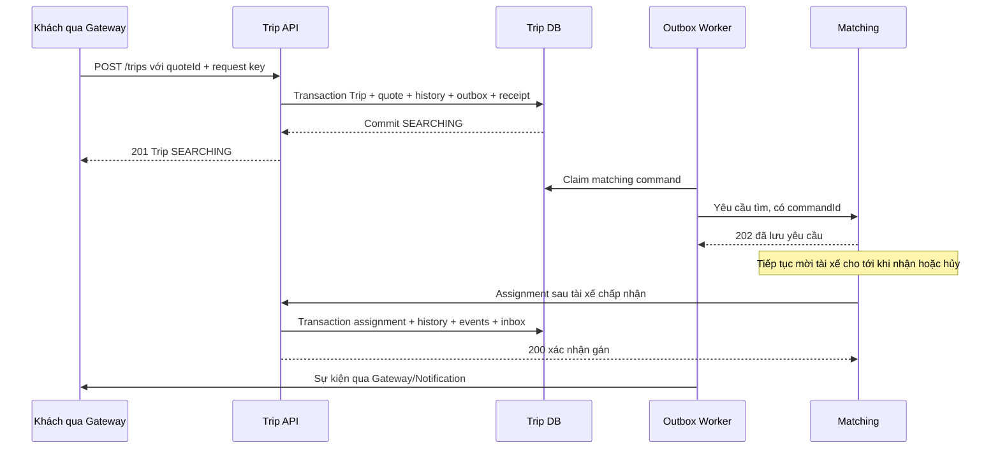

# Kiến trúc Trip Service

Ngày cập nhật: 05/10/2026. Phiên bản thiết kế: 0.1. Trạng thái: đề xuất để review, chưa triển khai.

Nguồn nghiệp vụ: [Nghiệp vụ Trip Service](nghiep-vu.md). Contract HTTP: [API](api.md), [Routes](routes.md). Vận hành: [Deploy](deploy.md).

Stack NestJS, TypeScript, TypeORM, PostgreSQL và REST callback + outbox đã được xác nhận. Cấu trúc code, schema bổ sung, port, định dạng API và cấu hình vận hành dưới đây là thiết kế đề xuất; cần validate ở component tương ứng. Hiện thư mục service chỉ có tài liệu, chưa có package, migration, ứng dụng hoặc worker.

## 1. Ranh giới hệ thống

Trip sở hữu vòng đời chuyến và quyết định việc gán. Routing sở hữu tuyến đường, Pricing sở hữu công thức giá, Matching sở hữu tìm/mời tài xế. User/Driver sở hữu hồ sơ; Gateway và Notification sở hữu kênh cập nhật đến ứng dụng.



- HTTP API và worker là hai tiến trình của cùng Trip Service, dùng chung schema và image phát hành.
- User/Driver database không nằm trong sơ đồ truy cập: Trip chỉ giữ ID tham chiếu và snapshot qua contract được xác thực.
- Không dùng Redis hoặc message broker cho Trip v1. Không đặt business rule vào Gateway.
- Không có deadline kết thúc tìm xe: `SEARCHING` tồn tại đến khi nhận chuyến hoặc khách hủy. Timeout HTTP chỉ là lỗi giao tiếp.

## 2. Các lớp và chiều phụ thuộc



| Lớp | Trách nhiệm | Giới hạn |
| --- | --- | --- |
| Domain | Entity Trip, state machine, quyền trên một chuyến, giá đã chốt, timestamp và domain event | TypeScript thuần; không import NestJS, TypeORM, DTO HTTP hoặc client bên ngoài |
| Application | Estimate/Create/Get/Update/Cancel/Receive Assignment; orchestration và transaction boundary | Phụ thuộc Domain và port, không phụ thuộc adapter cụ thể |
| Ports | Contract repository, unit of work, quote, identity, clock, ID, external client và delivery | Dùng kiểu application/domain; không trả TypeORM entity hoặc HTTP response thô |
| Infrastructure | TypeORM entity/mapper/repository, migration, HTTP adapter, JWT verifier, outbox delivery | Ánh xạ dữ liệu/lỗi thành contract của port; không tự thêm chính sách nghiệp vụ |
| Presentation | Route, DTO, xác thực, validation, response và error mapping | Lấy actor từ identity xác thực; gọi use case; không quyết định chuyển trạng thái |
| Bootstrap | Chọn adapter thật/mock và nối dependency | Chỉ tại đây biết concrete implementation |

Application use case được khởi tạo qua factory để giữ domain/application thuần. Nest đăng ký runtime token `Symbol` cho các port và nối adapter trong composition root; TypeScript interface không tự là token runtime. Cách nối này dựa trên [NestJS custom providers](https://docs.nestjs.com/fundamentals/custom-providers).

### Cấu trúc code dự kiến

```text
service/trip-service/
  docs/
  src/
    domain/                 # Trip, value objects, state machine, domain events
    application/
      use-cases/            # Các mốc C06, C09–C13
      ports/                # Repository, UnitOfWork, client, Clock, identity...
    infrastructure/
      persistence/          # Entity, mapper, repository, migrations, DataSource
      clients/              # Routing, Pricing, Matching, event destination
      auth/                 # JWT và service credential verifier
      outbox/               # Claim, lease, delivery, retry
    presentation/http/      # Controller, DTO, guard, exception filter
    bootstrap/              # Factory, module và cấu hình
    main.ts                 # Entry point API
    worker.ts               # Entry point dispatcher + health HTTP riêng
  test/                     # Unit, integration, contract, e2e
```

Cấu trúc này chưa được tạo ngoài phần `docs`/README. Build đề xuất giữ entry point thành `dist/main.js`, `dist/worker.js`, migration và DataSource trong `dist/infrastructure/persistence/` để khớp tài liệu deploy.

## 3. Các port chính

| Port | Năng lực tối thiểu | Component sử dụng |
| --- | --- | --- |
| `TripRepository` | Find by ID/active, insert, update theo expected version | Create, Get, Update, Cancel, Assignment |
| `TripQueryRepository` | Chi tiết/history và danh sách chuyến phân trang | Get Trip |
| `QuoteRepository` | Save, lấy quote có lock, đánh dấu sử dụng | Estimate, Create |
| `UnitOfWork` | Cung cấp các repository dùng cùng transaction | Các use case thay đổi dữ liệu |
| `RequestReceiptRepository` | Claim request key, so sánh hash, lưu/đọc kết quả | Create, Update, Cancel |
| `InboxRepository` | Nhận diện callback Matching đã xử lý | Receive Assignment |
| `OutboxRepository` | Append lệnh/sự kiện và delivery theo đích | Use case + dispatcher |
| `RoutingClient` / `PricingClient` | Estimate route / estimate fare | Estimate Trip |
| `MatchingClient` | Gửi lệnh tìm hoặc hủy tìm có command ID | Dispatcher; không gọi trong Create transaction |
| `TripEventClient` | Gửi event tới Gateway/Notification theo đích | Dispatcher |
| `IdentityVerifier` | Kiểm tra token, trả principal hợp lệ | Presentation |
| `Clock` / `IdGenerator` | Thời gian server và ID; có fake cho unit test | Application/domain khi cần |

Tên và chữ ký cụ thể được duyệt khi triển khai C00/C03. Domain kiểm tra một Trip; giới hạn active giữa nhiều Trip cần application và constraint database, không thể chỉ nằm trong entity.

## 4. Dữ liệu và transaction

| Bảng đề xuất | Dữ liệu/ràng buộc chính |
| --- | --- |
| `trip_quotes` | UUID, rider ID, điểm/loại xe, route/giá snapshot, created/expires, consumed trip ID nullable |
| `trips` | UUID, quote ID unique, rider/driver/vehicle ID, trạng thái/version, snapshots, giá, các mốc thời gian và dữ liệu hủy |
| `trip_status_history` | Trip ID, from/to, actor, thời điểm và version; unique `(trip_id, version)` |
| `request_receipts` | Actor type + actor ID + request key unique, operation/target, hash nội dung, status code/body kết quả |
| `inbox_messages` | Source + event ID unique, hash callback và kết quả assignment đã chấp nhận |
| `outbox` | UUID event/command ID, trip/version, loại, payload và thời điểm |
| `outbox_deliveries` | Outbox ID + destination unique; pending/processing/delivered/blocked/skipped, attempts, next retry, lease owner/expiry, lỗi đã làm sạch |

ID ngoài Trip là tham chiếu logic. Foreign key chỉ dùng trong database Trip. `BIGINT` tiền được serialize thành chuỗi số thập phân trong JSON để không mất độ chính xác; thời gian lưu `TIMESTAMPTZ`, API trả ISO 8601 UTC. Chi tiết wire model nằm trong [API](api.md).

Constraint đề xuất, cần đưa vào migration C03, không chạy từ tài liệu này:

```sql
CREATE UNIQUE INDEX uq_trips_active_rider ON trips (rider_id)
WHERE status IN ('CREATED', 'SEARCHING', 'ASSIGNED', 'DRIVER_ARRIVED', 'IN_PROGRESS');

CREATE UNIQUE INDEX uq_trips_active_driver ON trips (driver_id)
WHERE driver_id IS NOT NULL
  AND status IN ('CREATED', 'SEARCHING', 'ASSIGNED', 'DRIVER_ARRIVED', 'IN_PROGRESS');

CREATE UNIQUE INDEX uq_trips_quote ON trips (quote_id);
```

Các index bảo vệ nghiệp vụ ngay cả khi hai tiến trình cùng ghi; repository ánh xạ lỗi theo tên constraint thành lỗi business tương ứng. Cơ chế unique trên tập con tham khảo [PostgreSQL partial indexes](https://www.postgresql.org/docs/current/indexes-partial.html).

### Transaction boundary

- **Estimate:** gọi Routing/Pricing ngoài transaction; khi đủ kết quả hợp lệ mới lưu quote. Quote có hạn 5 phút từ lúc phát hành thành công.
- **Create:** claim receipt → lock quote → kiểm tra chủ/hạn sau khi lấy lock → tạo `CREATED` version 0 và history → chuyển `SEARCHING` version 1 → đánh dấu quote dùng → ghi matching command/events/deliveries → lưu receipt → commit.
- **Assignment:** claim inbox → lock Trip → kiểm tra `SEARCHING` và tài xế → cập nhật version/assignment → history/events → inbox ACK → commit.
- **Update/Cancel:** claim receipt → lock Trip → kiểm tra actor/version/state → domain command → update/history/outbox/receipt → commit.
- Mọi repository trong transaction dùng cùng transaction manager; không dùng global repository cho một phần write.
- Constraint unique và cập nhật theo `WHERE id = :id AND version = :expectedVersion` là lớp bảo vệ cuối. Thứ tự lock thống nhất, retry deadlock có giới hạn; hết retry trả lỗi tạm thời, không sửa trạng thái để né conflict.

Chọn `READ COMMITTED` kết hợp row lock, unique constraint và version compare cho v1. Không giữ transaction mở trong lúc HTTP hoặc ngủ retry. TypeORM entity không được trả trực tiếp ra HTTP.

## 5. Luồng phối hợp



Gateway/Notification giao tiếp với worker theo các route riêng trong [Routes](routes.md); mũi tên cuối biểu diễn kết quả đến người dùng qua hai service đó.

### Assignment và cancellation race

- Callback mới sau khi hủy bị từ chối; Matching giải phóng ứng viên. Callback trùng đã từng thành công nhận lại ACK, không thay đổi trạng thái hiện tại.
- Actor hủy dùng version đang thấy. Nếu assignment đã thắng trước, request hủy với version cũ trả conflict; khách đọc Trip mới và có thể hủy bằng version mới nếu còn trước `IN_PROGRESS`.
- Nếu hủy thắng trước, assignment không được ghi. Outbox phải thông báo hủy ngay cả khi request tìm đã được claim hoặc gửi.
- Matching lưu terminal marker cho chuyến đã hủy và không mở lại tìm từ lệnh search hoặc ACK assignment đến muộn. Command/event ID chống lặp; Trip version giúp phát hiện dữ liệu cũ.
- Tài xế bận hoặc ứng viên không được gán thì Matching tiếp tục tìm cho chuyến còn `SEARCHING`. Tài xế được gán rồi hủy thì chuyến kết thúc, không tìm lại.

## 6. Outbox và khả năng chạy nhiều worker

- Delivery chỉ được đánh dấu delivered khi bên nhận đã xác nhận lưu bền vững lệnh/event. `202` là đã tiếp nhận bền vững, không phải đã hoàn thành nghiệp vụ.
- Claim batch bằng transaction ngắn, row lock `FOR UPDATE SKIP LOCKED`, gán lease; commit rồi mới gọi HTTP.
- Khi ghi kết quả phải kiểm tra lease owner còn hợp lệ. Crash hoặc lease hết hạn thì worker khác có thể claim lại; bên nhận phải chống lặp.
- Retry mạng/timeout/5xx/429 có backoff. Không giới hạn tuổi search command theo thời gian tìm xe.
- 400/401/403/404/409 từ đích được phân loại theo contract, không mặc nhiên coi là thành công. Lỗi contract/credential chuyển blocked và cảnh báo; sau sửa cấu hình có cơ chế requeue có kiểm soát, không bỏ record.
- Lệnh tìm chưa gửi cho Trip đã hủy có thể skipped; vẫn bảo đảm có cancel command nếu từng có khả năng đích đã nhận search. Không chỉ dựa vào một lần đọc trước HTTP để kết luận race đã được giải quyết.
- Gateway và Notification có delivery riêng; lỗi một đích không làm đích khác bị mất event.
- Event payload chỉ có dữ liệu cần thiết; không ghi token, mật khẩu hoặc hồ sơ đầy đủ vào outbox/log.

## 7. Xác thực, quyền và chế độ mock

- API người dùng xác minh chữ ký JWT, issuer, audience, expiry và role. Principal gồm `sub` UUID và `role` là `RIDER`/`DRIVER`; không tin `X-User-Id`, body rider ID hoặc driver ID tự khai.
- Callback dùng credential riêng cho Matching qua `X-Service-Token`; credential không đi qua ứng dụng khách, không dùng chung với JWT.
- Identity hợp lệ chưa đủ quyền: use case luôn kiểm tra sở hữu/assignment. Không có quyền đọc trả 404; sai quyền hành động trên Trip được phép xem trả 403.
- Fake adapter và khóa thử chỉ ở local/test. `INTEGRATION_MODE=mock` trong production phải làm startup thất bại.
- API và worker chỉ có quyền database Trip. Migration dùng credential có quyền DDL riêng; runtime không tự migrate và không bật `synchronize`.

## 8. Vận hành, kiểm thử và điểm cần duyệt

- API có liveness và readiness riêng; readiness kiểm tra DB/schema, không phụ thuộc Routing/Pricing/Matching đang online để vẫn đọc/hủy chuyến được.
- Worker có probe riêng kiểm tra DB/schema và dispatch loop. Probe API không chứng minh worker đang hoạt động.
- Log/metric dùng request ID, trip ID, event/command ID và destination. Theo dõi tuổi outbox, blocked delivery, version conflict và chuyến `SEARCHING` lâu; không tự hủy từ alert.
- Unit test domain/use case dùng fake port; integration test dùng PostgreSQL thật; contract test mock từng đích; e2e kiểm tra HTTP + DB + worker.
- Triển khai theo C00–C15 ở tài liệu nghiệp vụ. Validate entity/schema, contract client và auth trước component tương ứng; chỉ push khi kết quả được duyệt.

Các quyết định đề xuất cần duyệt: cấu trúc code, tên bảng/port, version ban đầu, retention receipt/inbox/outbox, payload snapshot, health probe, retry/lease và topology Docker. Các chính sách giá, hủy và không deadline tìm xe vẫn theo tài liệu nghiệp vụ, không thay đổi bởi thiết kế kỹ thuật.
